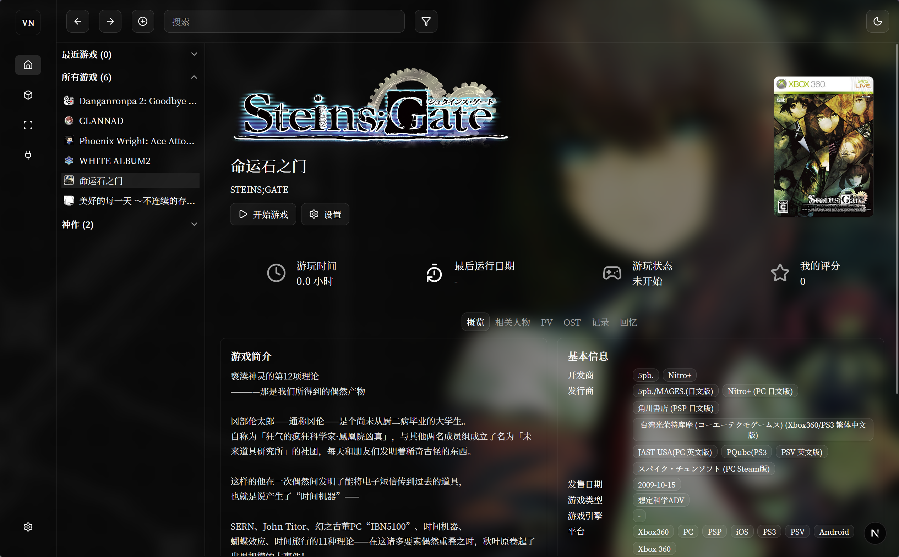

# vnweb

vnweb 是一个面向视觉小说与本地单机游戏整理场景的 Web 管理面板。它把本地游戏库、资料抓取、游玩记录、媒体整理、收藏分类和第三方账号联动整合到一个统一界面中，适合在 Windows 环境下管理自己的游戏收藏。

项目当前基于 Next.js App Router、React 19、TypeScript、TanStack Query、Drizzle ORM 与 SQLite 构建，UI 组件主要来自 shadcn/ui。

## 项目定位

这个项目不是单纯的游戏列表页面，而是一个偏“本地资料库 + 游戏启动器 + 媒体整理器”的工具，重点覆盖以下几类场景：

- 扫描本地目录并建立游戏库
- 维护游戏的封面、背景、图标、徽标、PV、OST、人物与回忆资料
- 记录游玩时长、查看统计图表和周期趋势
- 使用收藏夹、筛选与排序快速整理大量条目
- 接入 Steam、VNDB、Bangumi 等外部来源补全数据

## 主要功能

### 1. 游戏库管理

- 首页展示最近游戏、收藏夹和全部游戏
- 支持多选、批量删除、批量加入收藏夹、批量更新元数据
- 支持按名称、日期、评分、游玩时长等维度排序

### 2. 游戏详情页

- 展示基础资料、统计信息、角色、PV、OST、回忆与游玩记录
- 支持直接启动或结束游戏
- 支持修改基础信息与资料数据
- 支持设置游戏专属封面、背景、图标、Logo、可执行路径

### 3. 本地扫描与导入

- 支持维护多个扫描目录
- 支持按目录层级或按可执行文件扫描
- 支持配置扫描深度与排除目录
- 支持记录扫描失败项，便于后续修正

### 4. 媒体与内容管理

- 管理游戏 PV 与 OST 链接
- 支持本地导入音频、视频和 OST 歌词文件
- 内置 OST 播放器，支持顺序播放、随机播放、单曲循环、列表循环
- 支持游戏回忆管理，可上传截图并记录 Markdown 文本内容

### 5. 统计与记录

- 自动累计游戏游玩时长
- 支持周、月、年视图查看游玩趋势
- 提供折线图和柱状图两种展示方式

### 6. 第三方数据与账号联动

- 支持 Steam、VNDB、Bangumi 等外部数据源
- 支持绑定第三方账号
- 可扩展为从外部平台导入游戏资料、封面与关联信息

### 7. 外观与本地能力

- 支持背景图自定义与游戏背景联动
- 支持读取本地字体并导入到项目中使用
- 支持图片本地化缓存
- 支持本地图标提取、目录浏览与进程监控

## 技术栈

- 前端框架：Next.js 16 + React 19 + TypeScript
- 状态与数据：TanStack Query、Jotai
- UI：shadcn/ui、Radix、Lucide、Tailwind CSS 4
- 图表：Recharts
- 数据库：SQLite + Drizzle ORM
- 媒体处理：hls.js、MDX、浏览器端图片处理
- 测试：Vitest
- 代码质量：oxlint、oxfmt

## 运行环境

建议环境：

- Node.js 20+
- npm 10+
- Windows

之所以推荐 Windows，是因为项目包含本地字体读取、游戏进程监控、本地图标提取、本地文件浏览等能力，当前实现明显偏向 Windows 桌面环境。

## 快速开始

### 1. 安装依赖

```bash
npm install
```

### 2. 配置环境变量

在项目根目录创建 `.env`，至少配置数据库路径：

```env
DB_FILE_NAME=file:./local.db
```

可选环境变量：

```env
STEAM_API_KEY=
STEAM_WEB_API_KEY=
NEXT_PUBLIC_STEAM_API_KEY=

VNDB_OAUTH_CLIENT_ID=
VNDB_OAUTH_CLIENT_SECRET=
VNDB_OAUTH_SCOPE=
VNDB_OAUTH_AUTHORIZE_URL=
VNDB_OAUTH_TOKEN_URL=
VNDB_OAUTH_USERINFO_URL=

BANGUMI_OAUTH_CLIENT_ID=
BANGUMI_OAUTH_CLIENT_SECRET=
```

说明：

- `DB_FILE_NAME` 是运行时必须配置的关键项
- Steam 与 OAuth 相关变量属于可选项，仅在启用对应功能时需要

### 3. 初始化数据库

```bash
npx drizzle-kit generate
npx drizzle-kit migrate
```

如果是全新开发环境，也可以直接在清理旧库后重新执行迁移。

### 4. 启动开发服务器

```bash
npm run dev
```

默认打开后会重定向到 `/game/home`。

## 常用脚本

```bash
npm run dev          # 启动开发环境
npm run build        # 构建生产版本
npm run start        # 启动生产服务
npm run lint         # 代码检查
npm run lint:fix     # 自动修复部分问题
npm run fmt          # 格式化代码
npm run fmt:check    # 检查格式
npm run test         # 运行测试
npm run db:studio    # 打开 Drizzle Studio
```

## 数据模型概览

当前数据库主要围绕以下实体组织：

- 游戏基础信息
- 游戏游玩状态与总时长
- 游戏 PV
- 游戏 OST
- 游戏角色
- 游戏回忆
- 游戏游玩记录
- 收藏夹与收藏夹关联
- 扫描目录与扫描错误
- 外部数据源映射
- 第三方账号绑定

这意味着项目已经具备从“游戏条目”延伸到“媒体、人物、记录、同步信息”的完整资料管理能力。

## 目录说明

```text
app/                Next.js 路由与 API
components/         业务组件与通用 UI
db/                 Drizzle 数据表定义
drizzle/            数据库迁移文件
lib/                前后端通用工具与请求逻辑
public/             静态资源与导入字体
types/              项目类型定义
win/                Windows 本地能力实现
```

## 接口统计

- 接口文件总数：67
- GET：34
- POST：33
- PUT：3
- PATCH：6
- DELETE：9
- OPTIONS：0
- HEAD：0
- 未识别标准 HTTP 导出：7

### 按模块统计

- addOns：2 个（已识别方法 2 个）
- collection：2 个（已识别方法 2 个）
- db：5 个（已识别方法 0 个）
- game：27 个（已识别方法 26 个）
- market：5 个（已识别方法 5 个）
- record：5 个（已识别方法 5 个）
- scan：4 个（已识别方法 4 个）
- settings：16 个（已识别方法 16 个）
- test：1 个（已识别方法 0 个）

### 接口清单（按模块）

#### addOns
- [GET,POST,PUT,DELETE] /api/addOns/cctv-4k/sources
- [GET] /api/addOns/cctv-4k/stream

#### collection
- [GET,POST] /api/collection
- [POST,PATCH,DELETE] /api/collection/[id]/game

#### db
- [未识别] /api/db/bgm
- [未识别] /api/db/sgdb
- [未识别] /api/db/vndb
- [未识别] /api/db/vndb/character/[id]
- [未识别] /api/db/vndb/characters

#### game
- [POST] /api/game
- [GET,PATCH,DELETE] /api/game/[id]
- [POST] /api/game/[id]/browse-local
- [POST] /api/game/[id]/image-localize
- [POST] /api/game/[id]/launch
- [GET,POST] /api/game/[id]/memory
- [PATCH,DELETE] /api/game/[id]/memory/[memoryId]
- [GET,POST,PATCH,DELETE] /api/game/[id]/ost
- [POST] /api/game/[id]/ost/import
- [POST] /api/game/[id]/ost/lyric
- [GET,POST,PATCH,DELETE] /api/game/[id]/pv
- [POST] /api/game/[id]/pv/import
- [POST] /api/game/[id]/pv/steam-sync
- [GET,PUT] /api/game/[id]/records
- [GET] /api/game/[id]/runtime
- [POST] /api/game/[id]/stop
- [GET] /api/game/bangumi-import/search
- [未识别] /api/game/extract-icon
- [GET] /api/game/filter-options
- [POST] /api/game/image-search
- [GET] /api/game/list
- [POST] /api/game/metadata-batch
- [GET] /api/game/sidebar
- [POST] /api/game/steam-import
- [GET,POST] /api/game/steam-import/name-search
- [POST] /api/game/steam-import/search
- [GET] /api/game/vndb-import/search

#### market
- [GET] /api/market/plugins
- [GET] /api/market/plugins/assets/[...path]
- [POST] /api/market/plugins/import
- [POST] /api/market/plugins/install
- [POST] /api/market/plugins/uninstall

#### record
- [GET] /api/record/export
- [GET] /api/record/month-report
- [GET] /api/record/overview/stats
- [GET] /api/record/timeline
- [GET] /api/record/year-report

#### scan
- [GET] /api/scan/error
- [GET,POST] /api/scan/scanner
- [PATCH,DELETE] /api/scan/scanner/[id]
- [POST] /api/scan/scanner/[id]/start

#### settings
- [POST] /api/settings/background/upload
- [POST] /api/settings/backup/export
- [POST] /api/settings/backup/import
- [GET,POST,DELETE] /api/settings/cloud-sync/accounts
- [GET] /api/settings/cloud-sync/auth/bangumi/callback
- [GET] /api/settings/cloud-sync/auth/bangumi/start
- [GET] /api/settings/cloud-sync/auth/steam/callback
- [GET] /api/settings/cloud-sync/auth/steam/start
- [GET] /api/settings/cloud-sync/auth/vndb/callback
- [GET] /api/settings/cloud-sync/auth/vndb/start
- [POST] /api/settings/cloud-sync/steam/sync-playtime
- [POST] /api/settings/font/cleanup
- [POST] /api/settings/font/import
- [GET] /api/settings/font/local-list
- [GET,POST,PUT,DELETE] /api/settings/proxy
- [GET] /api/settings/proxy/test

#### test
- [未识别] /api/test

## 适合的使用场景

- 管理本地视觉小说游戏库
- 为游戏维护更完整的封面、Logo、PV、OST 与角色资料
- 统计个人游玩记录与周期变化
- 为多来源数据建立统一本地档案
- 在一个界面里完成“启动游戏 + 维护资料 + 查看记录”

## 当前规划

- 支持自定义项目 Logo 和标题
- 支持 OST 后台播放
- 支持进入游戏详情时自动播放 OST
- 持续扩展 Steam、Bangumi、VNDB 等平台联动能力

## 开发说明

### 数据库迁移

```bash
npx drizzle-kit generate
npx drizzle-kit migrate
```

### 数据库可视化

```bash
npm run db:studio
```

界面截图：

