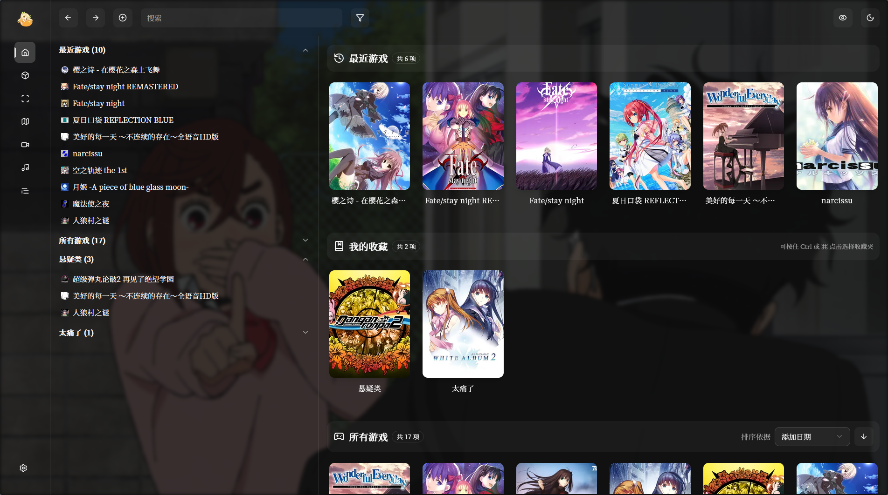
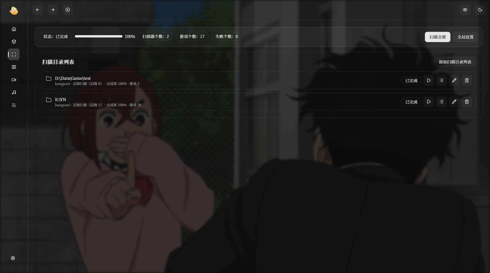
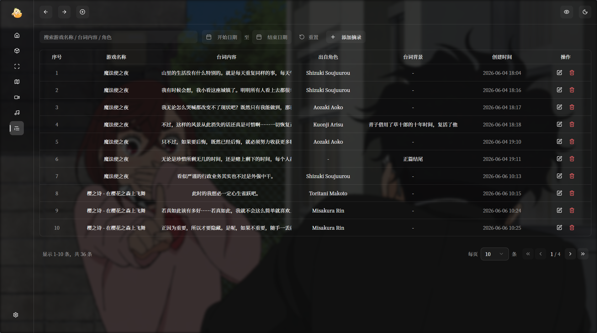
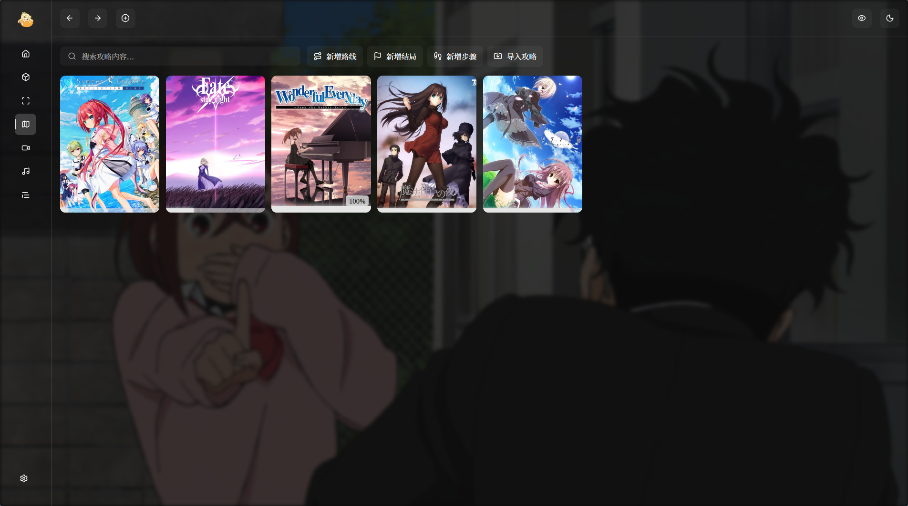
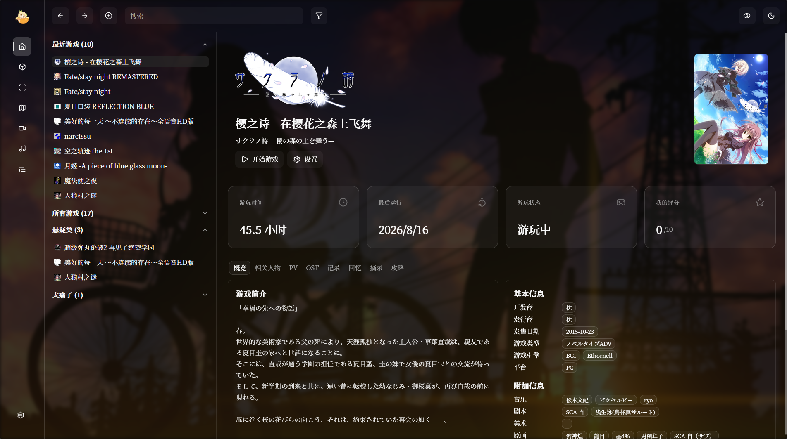
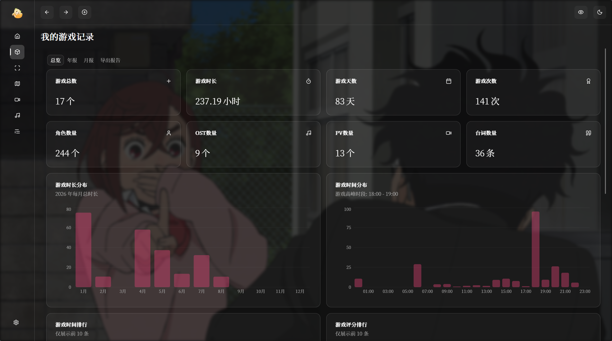
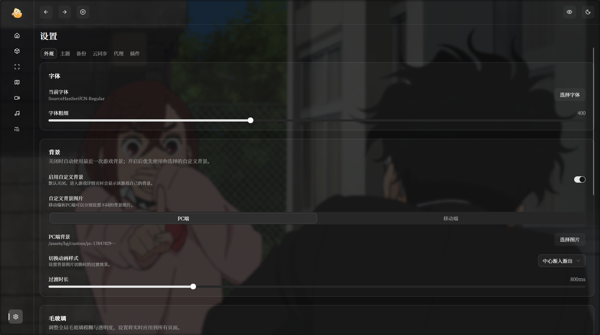

# vnweb

vnweb 是一个面向视觉小说与本地单机游戏整理场景的 Web 管理面板。它把本地游戏库、资料抓取、游玩记录、媒体整理、收藏分类和第三方账号联动整合到一个统一界面中，适合在 Windows 环境下管理自己的游戏收藏。

项目当前基于 Next.js App Router、React 19、TypeScript、TanStack Query、Drizzle ORM 与 SQLite 构建，UI 组件主要来自 shadcn/ui。

## 项目定位

这个项目不是单纯的游戏列表页面，而是一个偏“本地资料库 + 游戏启动器 + 媒体整理器”的工具，重点覆盖以下几类场景：

- 扫描本地目录并建立游戏库
- 维护游戏的封面、背景、图标、徽标、PV、OST、人物与回忆资料
- 记录游玩时长、查看统计图表和周期趋势
- 使用收藏夹、筛选与排序快速整理大量条目
- 接入 Steam、VNDB、Bangumi 等外部来源补全数据

## 主要功能

### 1. 游戏库管理

- 首页展示最近游戏、收藏夹和全部游戏
- 支持多选、批量删除、批量加入收藏夹、批量更新元数据
- 支持按名称、日期、评分、游玩时长等维度排序

### 2. 游戏详情页

- 展示基础资料、统计信息、角色、PV、OST、回忆与游玩记录
- 支持直接启动或结束游戏
- 支持修改基础信息与资料数据
- 支持设置游戏专属封面、背景、图标、Logo、可执行路径

### 3. 本地扫描与导入

- 支持维护多个扫描目录
- 支持按目录层级或按可执行文件扫描
- 支持配置扫描深度与排除目录
- 支持记录扫描失败项，便于后续修正

### 4. 媒体与内容管理

- 管理游戏 PV 与 OST 链接
- 支持本地导入音频、视频和 OST 歌词文件
- 内置 OST 播放器，支持顺序播放、随机播放、单曲循环、列表循环
- 支持游戏回忆管理，可上传截图并记录 Markdown 文本内容

### 5. 统计与记录

- 自动累计游戏游玩时长
- 支持周、月、年视图查看游玩趋势
- 提供折线图和柱状图两种展示方式

### 6. 第三方数据与账号联动

- 支持 Steam、VNDB、Bangumi 等外部数据源
- 支持绑定第三方账号
- 可扩展为从外部平台导入游戏资料、封面与关联信息

### 7. 外观与本地能力

- 支持背景图自定义与游戏背景联动
- 支持读取本地字体并导入到项目中使用
- 支持图片本地化缓存
- 支持本地图标提取、目录浏览与进程监控

### 8. 游戏攻略

- 支持从[yjgalgame](https://www.yjgalgame.com/)导入攻略
- 支持自定义攻略（根据系统给出的提示词，把其他游戏的攻略文本交给ai，得到一段json数据，就可以导入）

### 9. 游戏台词摘录

- 支持按照角色来进行台词摘录分类

### 10. 自动备份

- 支持在游戏结束后在本机的指定路径自动备份游戏存档（很有用！）

## 技术栈

- 前端框架：Next.js 16 + React 19 + TypeScript
- 状态与数据：TanStack Query、Jotai
- UI：shadcn/ui、Radix、Lucide、Tailwind CSS 4
- 图表：Recharts
- 数据库：SQLite + Drizzle ORM
- 媒体处理：hls.js、MDX、浏览器端图片处理
- 代码质量：oxlint、oxfmt

## 运行环境

建议环境：

- Node.js 20+
- npm 10+
- Windows

之所以推荐 Windows，是因为项目包含本地字体读取、游戏进程监控、本地图标提取、本地文件浏览等能力，当前实现明显偏向 Windows 桌面环境。

## 快速开始

### 1. 安装依赖

```bash
npm install
```

### 2. 编写配置文件

见`app/config.example.ts`，填写好配置后，把该文件重命名为`config.ts`

### 3. 初始化数据库

```bash
npx drizzle-kit generate
npx drizzle-kit migrate
```

如果是全新开发环境，也可以直接在清理旧库后重新执行迁移。

### 4. 构建

```bash
npm run build
```

### 5. 环境变量

这里推荐将根目录下的`vnweb.bat`添加至环境变量中，然后你就可以在任意的位置执行系统的命令行工具：

```sh
# 1. 启动 web ui
vnweb

# 2. 查看帮助文档
vnweb --help

# 3. 查看游戏列表
vnweb list game

# 4. 根据名称搜索游戏
vnweb search game_name

# 5. 根据id启动游戏
vnweb start game_id
```

## 常用脚本

```bash
npm run dev          # 启动开发环境
npm run build        # 构建生产版本
npm run start        # 启动生产服务
npm run lint         # 代码检查
npm run lint:fix     # 自动修复部分问题
npm run fmt          # 格式化代码
npm run fmt:check    # 检查格式
npm run test         # 运行测试
npm run db:studio    # 打开 Drizzle Studio
```

界面截图：













