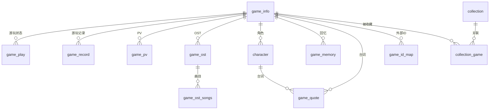

# 数据模型

vnweb 使用 SQLite 作为数据库，通过 Drizzle ORM 定义和管理数据模型。

## 核心表结构

### game_info — 游戏信息

存储游戏的基本信息、制作信息和媒体资源路径。

```ts
export const GameInfoTable = sqliteTable('game_info', {
  id: int().primaryKey({ autoIncrement: true }),
  date: text().notNull(),
  cover: text().default(''),
  icon: text().default(''),
  logo: text().default(''),
  bg: text().default(''),
  summary: text().notNull(),
  name: text().notNull(),
  nameCn: text().notNull(),
  tags: text().notNull(),
  nsfw: int().notNull(),
  ailases: text().notNull(),
  platforms: text().notNull(),
  gameType: text().notNull(),
  gameEngine: text().notNull(),
  music: text().notNull(),
  script: text().notNull(),
  graphic: text().notNull(),
  originalPainter: text().notNull(),
  animationProduction: text().notNull(),
  developer: text().notNull(),
  publisher: text().notNull(),
  programmer: text().notNull(),
  saveDir: text().default(''),
  createdAt: text(),
  updatedAt: text(),
})
```

### game_play — 游玩状态

记录每个游戏的游玩状态和累计统计数据。

| 关键字段        | 说明             |
| --------------- | ---------------- |
| `exePath`       | 可执行文件路径   |
| `isRunning`     | 是否正在计时     |
| `totalPlayTime` | 总游玩时长（秒） |
| `playCount`     | 游玩次数         |
| `rating`        | 评分（0-10）     |
| `status`        | 游戏状态（0-5）  |

### game_record — 游玩记录

每次游玩的详细记录。

### game_pv — PV 视频

游戏宣传视频链接。

### game_ost + game_ost_songs — OST 与曲目

OST 专辑和曲目信息，曲目支持歌词（文本或 .lrc 文件）。

### character — 角色

游戏关联角色，主要来自 VNDB 导入。

### game_memory — 回忆

游戏回忆截图与文字记录。

### collection + collection_game — 收藏夹

收藏夹及其游戏关联（多对多）。

### scanner — 扫描目录

本地扫描目录配置与进度。

### game_id_map — 外部 ID 映射

本地游戏 ID 与外部数据源 ID 的映射关系。

### third_party_account — 第三方账号

第三方平台账号绑定信息。

### game_quote — 台词摘录

从游戏中摘录的台词，关联角色与游戏。

### relate_website — 相关网站

游戏相关的链接。

## 关系概览



## 迁移管理

数据库 Schema 定义在 `db/schema.ts` 中，迁移文件位于 `drizzle/` 目录。

### 常用命令

```bash
# 生成迁移文件
npx drizzle-kit generate

# 执行迁移
npx drizzle-kit migrate

# 打开 Drizzle Studio 可视化管理
npm run db:studio
```
