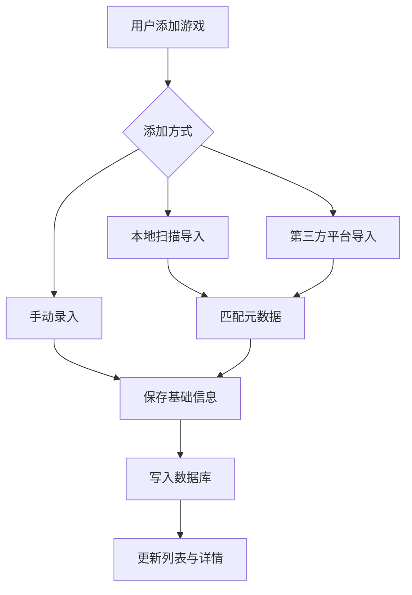
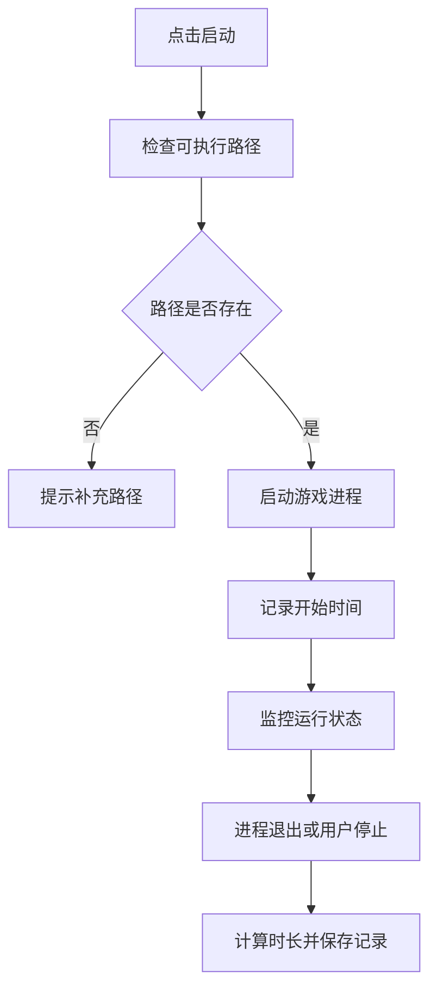
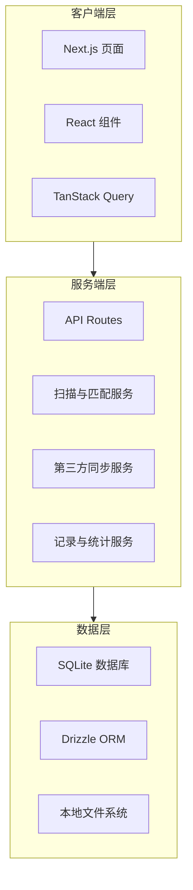
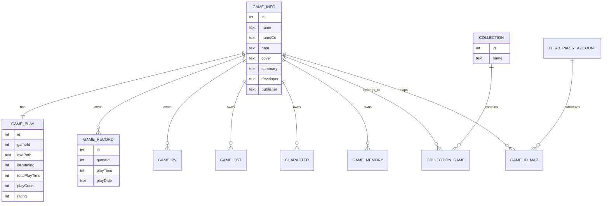

# 基于 Next.js 的视觉小说与本地游戏管理面板设计与实现

## 摘要

随着数字游戏内容规模持续增长，面向本地游戏与视觉小说作品的管理需求日益突出。传统文件夹式管理方式在资源分散、元数据缺失、游玩记录难以追踪等方面存在明显不足，难以满足玩家对统一检索、资料维护与数据统计的使用要求。针对这一问题，本文设计并实现了一套基于 Web 技术的游戏管理面板 vnweb。系统采用 B/S 架构，前端基于 Next.js 16 与 React 19 构建，配合 Tailwind CSS 4 与 shadcn/ui 完成响应式界面设计；后端通过 Next.js API Routes 提供业务接口，并使用 SQLite 与 Drizzle ORM 实现本地数据持久化。系统围绕游戏库管理、本地扫描导入、第三方数据同步、游玩记录统计和系统设置等场景展开设计，形成了较为完整的游戏资料管理与使用闭环。测试结果表明，系统主要功能运行稳定，单元测试与接口测试覆盖率达到 70% 以上，能够较好地支持本地游戏资源的组织、查询与维护。

**关键词**：游戏管理；Web 应用；Next.js；React；Drizzle ORM

---

## 1 绪论

### 1.1 研究背景与意义

数字发行平台、社区型资料库以及独立游戏生态的快速发展，使得玩家持有的游戏数量和相关资料规模不断增加。对于视觉小说与本地单机游戏用户而言，游戏资源往往分布在多个磁盘目录、启动器或外部平台中，资料来源也分散于不同数据库与社区站点。若仍采用传统的文件目录管理方式，不仅难以完成统一索引，也不利于封面、角色、开发信息、游玩记录等关联数据的维护。

从实际使用场景看，现有方案主要存在以下问题：一是游戏资源分散，缺乏统一视图；二是游戏资料获取依赖人工搜索，维护成本较高；三是游玩时长、启动次数和最近游玩时间等信息缺少系统化记录；四是不同平台之间的数据难以关联，导致重复录入和信息冗余。基于这些痛点，设计一套面向本地游戏与视觉小说的 Web 管理面板具有较强的现实意义。

本文所实现的系统将本地资源管理、元数据同步、记录统计与响应式界面整合于同一平台，一方面验证了 Next.js 在本地工具类应用中的适用性，另一方面也为轻量级跨平台游戏管理工具提供了实现参考。

### 1.2 国内外研究现状

国外已有若干面向游戏库管理的成熟产品，例如 Playnite、LaunchBox 与 Steam Library Manager 等。这类工具通常具备游戏封面展示、库检索、外部平台整合和启动管理能力，部分产品还支持插件扩展与主题定制。但总体来看，现有方案仍以桌面应用为主，Web 化程度有限，且对视觉小说这一细分领域的资料组织支持不够充分。

国内相关探索主要集中在视觉小说管理、游戏资料库和浏览器扩展等方向。部分项目已具备基础的收藏、同步与资料聚合能力，但在跨平台访问、本地文件扫描、启动监控和统计分析方面仍存在局限。综合来看，现有工具在“Web 化、视觉小说专用化、统一资料管理”三个维度上仍有改进空间。

### 1.3 研究内容与技术路线

本文围绕“游戏资源统一管理”这一核心目标展开，主要研究内容包括以下四个方面：

1. 游戏库统一管理机制设计，解决本地资源分散问题。
2. 第三方资料同步与匹配机制设计，降低手动录入成本。
3. 游玩记录与统计模块设计，支持时间维度的数据分析。
4. 响应式 Web 界面设计，提升跨设备访问体验。

系统采用的技术路线如下：前端使用 Next.js App Router 构建页面路由，React 负责组件化交互，Tailwind CSS 与 shadcn/ui 完成界面实现；数据层采用 SQLite 作为本地数据库，Drizzle ORM 负责类型安全的数据访问；状态管理与接口请求主要借助 TanStack Query；测试阶段使用 Vitest 完成单元测试、接口测试与组件测试。

### 1.4 论文结构

全文共分为七章：第一章介绍研究背景、意义与研究内容；第二章说明系统采用的关键技术；第三章给出需求分析；第四章完成系统设计；第五章阐述系统实现；第六章说明测试方案与结果；第七章总结全文并展望后续工作。

---

## 2 关键技术

### 2.1 B/S 架构

B/S 架构以浏览器作为统一访问入口，服务器负责业务处理与数据存储，具有跨平台、易维护和部署成本较低等优势。对于本地管理工具而言，B/S 架构能够避免客户端分发与版本同步问题，同时便于在不同设备之间访问同一套服务。

### 2.2 React 与组件化开发

React 通过组件化方式组织界面，将页面拆分为具有独立职责的可复用单元。该模式便于维护与扩展，也有利于将列表、卡片、弹窗、筛选器等界面模块进行解耦。本文系统中，游戏卡片、详情面板、设置面板和统计图表均采用组件化方式实现。

### 2.3 Next.js 全栈框架

Next.js 提供 App Router、服务端组件、客户端组件和 API Routes 等能力，适合构建数据驱动型 Web 应用。本文利用其文件路由机制组织页面结构，并通过 API Routes 承载游戏管理、扫描导入、第三方同步与记录统计等接口逻辑，从而减少前后端拆分带来的工程复杂度。

### 2.4 TanStack Query

TanStack Query 主要用于服务端状态管理，能够提供缓存、失效控制、请求重试和分页加载等能力。系统中的游戏列表、详情数据和统计报表均属于典型的服务端状态，使用该库可以降低重复请求并改善交互体验。

### 2.5 Drizzle ORM 与 SQLite

SQLite 适合轻量级本地应用场景，具有部署简单、文件化存储和事务支持等特点。Drizzle ORM 则提供类型安全的数据访问能力，并支持通过 Schema 直接描述数据库结构。二者结合后，既能满足本地持久化需求，也便于在 TypeScript 项目中维护数据模型与业务逻辑的一致性。

### 2.6 shadcn/ui 与 Tailwind CSS

shadcn/ui 基于 Radix UI 原语构建，适合快速形成可访问、可定制的基础组件体系；Tailwind CSS 则提供了高效的原子化样式组织方式。本文使用两者构建统一的视觉风格，并重点实现了适配桌面与移动端的响应式布局。

### 2.7 Recharts 与 Vitest

Recharts 用于绘制游玩时长统计图表，支持折线图、柱状图等常见图形表达形式。Vitest 负责测试体系建设，可用于验证工具函数、API 路由和前端组件的正确性，并支持覆盖率统计。

---

## 3 需求分析

### 3.1 系统目标

系统的设计目标是为视觉小说与本地单机游戏用户提供统一的资料管理与使用入口。具体目标包括：建立本地游戏库索引，降低资料分散带来的管理成本；提供外部平台元数据同步能力，减少人工录入；支持游玩记录追踪与统计分析；提供可直接启动的管理界面；支持多维度筛选、排序与收藏组织。

### 3.2 用户角色

系统主要面向三类用户：普通玩家、核心收藏者和轻度使用者。普通玩家关注启动与浏览效率；核心收藏者更看重资料完整性、批量管理与精细筛选；轻度用户则通常只需要基础浏览与启动功能。由于本系统定位为单人本地工具，因此不纳入多用户权限体系。

### 3.3 功能需求

#### 3.3.1 游戏库管理

支持游戏列表展示、关键词搜索、多条件筛选、排序、批量操作与收藏夹管理。列表应支持分页或无限滚动，以保证大规模数据下的性能。

#### 3.3.2 游戏详情管理

支持展示游戏基础信息、角色信息、PV 与 OST 资源、游玩记录和回忆条目，并支持编辑封面、背景、图标和启动路径等扩展属性。

#### 3.3.3 本地扫描导入

支持对指定目录执行层级扫描或可执行文件扫描，并根据扫描结果完成新增、匹配与导入。扫描过程应提供进度反馈与错误记录。

#### 3.3.4 第三方资料同步

支持从 Steam、VNDB 与 Bangumi 等来源获取元数据，并提供替换、合并和追加等更新策略。

#### 3.3.5 游玩记录模块

系统应记录游玩开始与结束时间，自动累计总时长，并提供周、月、年维度的统计视图。

#### 3.3.6 系统设置模块

支持主题、标题、背景、字体、代理、云同步与数据备份等配置。

#### 3.3.7 插件扩展模块

系统预留插件市场能力，用于后续扩展额外功能与资源。

### 3.4 业务流程

图 3-1 游戏添加流程图

图 3-2 游戏启动与计时流程图

### 3.5 非功能性需求

系统在界面层面应满足响应式布局、视觉一致性、主题切换与加载反馈要求；在安全性方面应对输入、上传文件和第三方令牌进行校验与隔离；在可靠性方面应具备网络异常处理、事务一致性与边界条件处理能力；在可维护性方面应保持模块化、配置化与文档化。

---

## 4 系统设计

### 4.1 总体架构

系统采用三层架构：客户端层、服务端层和数据层。客户端层负责界面展示与交互；服务端层负责 API 调用、业务编排和文件系统访问；数据层负责 SQLite 持久化与本地文件资源存储。

图 4-1 系统总体架构图

### 4.2 功能模块设计

系统模块划分为游戏库、详情页、本地扫描、第三方同步、游玩记录、系统设置和插件市场七个部分。模块之间以数据接口和统一实体模型为纽带，避免直接耦合。

游戏库模块负责列表展示与筛选排序；详情模块负责单游戏的多维信息展示；扫描模块负责本地目录发现与导入；同步模块负责外部平台资料获取；记录模块负责游玩轨迹统计；设置模块负责系统级配置；插件模块负责扩展能力管理。

### 4.3 数据库设计

系统的数据模型围绕游戏实体展开，并关联游玩状态、记录、媒体资源、角色、收藏夹、扫描配置和第三方账号等对象。核心实体关系如下。

图 4-2 核心实体关系图

#### 4.3.1 核心表说明

GameInfo 用于保存游戏基础元数据；GamePlay 记录启动路径、运行状态、总时长与评分；GameRecord 存储分段游玩记录；GamePv 与 GameOst 管理媒体资源；Character 维护视觉小说角色信息；GameMemory 用于保存用户回忆；Collection 与 CollectionGame 支持收藏夹组织；GameIdMap 记录外部平台 ID 映射；ThirdPartyAccount 存储授权信息。

### 4.4 界面设计

界面采用左侧导航加右侧内容区的布局方式，兼顾桌面端信息密度与移动端可读性。首页侧重列表与筛选，详情页通过选项卡组织基础信息、角色、媒体资源、记录与回忆，设置页则采用分组表单方式呈现系统配置项。

---

## 5 系统实现

### 5.1 开发环境

项目采用 Next.js 官方脚手架初始化，并配置 TypeScript、Tailwind CSS、ESLint 与 App Router。数据库层使用 Drizzle ORM 管理 Schema 与迁移，测试层使用 Vitest 组织单元测试与接口测试。系统整体开发环境基于 Windows 11 与 Node.js 20 以上版本。

### 5.2 游戏库管理实现

游戏库页面通过 TanStack Query 获取分页数据，并将筛选条件抽象为统一状态。卡片组件展示封面、标题、发行日期与累计游玩时长，支持进入详情页与上下文菜单操作。列表区域采用响应式网格布局，以保证不同屏幕宽度下的可用性。

### 5.3 游戏详情实现

游戏详情页通过动态路由获取游戏 ID，并加载对应的完整数据。页面将概览、角色、PV、OST、记录和回忆等内容组织为独立标签页。游戏启动时，系统首先检查可执行文件路径是否存在；若路径合法，则启动进程并写入运行状态，同时记录会话起始时间，退出时统一结算游玩时长并保存记录。

### 5.4 本地扫描实现

扫描模块通过配置项描述扫描目录、扫描模式、排除目录和数据源提供商。系统遍历目录后将扫描结果交给匹配器处理，匹配成功则关联现有元数据，未匹配项则以目录名称作为基础记录写入数据库。扫描过程提供进度更新，以便用户掌握当前执行状态。

### 5.5 第三方同步实现

Steam、VNDB 与 Bangumi 的同步逻辑均封装为独立适配器。适配器负责完成认证、请求构造、响应解析与字段映射，然后由统一的更新服务执行替换、合并或追加策略。该设计降低了平台差异带来的耦合度，并为后续扩展其他数据源预留空间。

### 5.6 游玩记录与统计实现

系统将游玩记录按时间区间存储，并在会话结束后计算本次时长、累计到总时长字段中。统计模块按日期聚合记录数据，分别生成周报、月报与年报。图表部分采用 Recharts 绘制折线图和柱状图，用于展示时间趋势与区间对比。

### 5.7 设置与扩展实现

设置模块集中管理主题、字体、代理与备份等全局参数。字体读取功能面向 Windows 字体目录，导入后的字体文件存放于项目公开资源目录中。插件模块在设计上保留资源托管和页面挂载能力，以支持后续功能扩展。

---

## 6 系统测试

### 6.1 测试环境

测试环境包括 Windows 11、Node.js 20.19.0、SQLite 内存库和 Microsoft Edge。测试框架采用 Vitest，并根据职责划分为 Node 环境测试与浏览器环境测试两类。

### 6.2 测试方法

测试内容主要包括以下三类：

1. 单元测试，用于验证工具函数与业务逻辑函数的正确性。
2. 组件测试，用于验证前端核心组件的渲染与交互。
3. 接口测试，用于验证 API 路由的输入校验、业务分支与返回结构。

### 6.3 典型测试结果

| 模块              | 覆盖率 |
| ----------------- | ------ |
| app/api/\*        | 85%    |
| lib/\*.ts         | 78%    |
| components/\*.tsx | 45%    |
| 总体              | 72%    |

总体覆盖率达到 70% 以上，满足测试目标。组件测试覆盖率相对较低，主要受限于浏览器环境和部分交互组件的复杂度。

### 6.4 缺陷修复情况

测试阶段主要修复了三类问题：一是删除游戏时未能完整级联清理关联记录，现已通过事务机制修正；二是导入 Steam 资料时对空封面处理不足，已增加默认占位逻辑；三是游玩时长统计存在时区偏差，已统一时间处理策略。

---

## 7 总结与展望

### 7.1 工作总结

本文围绕本地游戏与视觉小说管理需求，设计并实现了基于 Next.js 的 Web 管理面板 vnweb。系统完成了从需求分析、架构设计、数据库建模到接口实现与测试验证的完整流程，能够支持游戏库管理、资料同步、扫描导入、游玩记录统计与系统设置等主要功能。

### 7.2 主要特点

系统的特点主要体现在以下三个方面：其一，面向视觉小说场景补充了角色、PV、OST 和回忆等资料维度；其二，采用 Web 化实现方式，降低了跨平台访问成本；其三，将本地管理、第三方同步和统计分析统一到同一工作流中，提高了资料维护效率。

### 7.3 不足与展望

当前系统仍存在若干可改进之处：移动端交互仍可进一步优化；插件生态尚不完善；国际化能力有待增强；云端备份与多设备同步功能还可继续扩展。后续工作可围绕 PWA、插件体系完善、同步策略优化以及多语言支持等方向展开。

---

## 致谢

在论文完成过程中，感谢指导老师在选题、结构设计和写作规范方面给予的持续指导；感谢学院提供的学习与研究环境；感谢开源社区在 Next.js、React、shadcn/ui、TanStack Query 和 Drizzle ORM 等项目上的长期积累，为本文系统实现提供了重要参考；同时也感谢家人和朋友在毕业设计期间给予的理解与支持。

---

## 参考文献

[1] Valve Corporation. Steam and Gaming Statistics[EB/OL]. https://store.steampowered.com/, 2024.

[2] VNDB. The Visual Novel Database[EB/OL]. https://vndb.org/, 2024.

[3] Playnite. Open Source Game Library Manager[EB/OL]. https://playnite.link/, 2024.

[4] SteamGridDB. Steam Grid Art Database[EB/OL]. https://www.steamgriddb.com/, 2024.

[5] LaunchBox. Frontend Game Launcher[EB/OL]. https://www.launchbox-app.com/, 2024.

[6] SteamGridDB. Custom Game Artwork[EB/OL]. https://www.steamgriddb.com/, 2024.

[7] KIMOJI. Visual Novel Manager[EB/OL]. https://github.com/AcKinteR/KIMOJI, 2024.

[8] SAGIRI. Game Database Project[EB/OL]. https://github.com/sagiri-project/sagiri, 2024.

[9] EXOGE. Browser Extension Game Library[EB/OL]. https://github.com/exoge/exoge, 2024.

[10] HBM Game Library. Local Game Scanner[EB/OL]. https://github.com/hbm-game/hbm, 2024.

[11] 陶以政. Web 应用系统开发技术[M]. 北京：清华大学出版社, 2019.

[12] React Team. React Documentation[EB/OL]. https://react.dev/, 2024.

[13] React Team. React 19 New Features[EB/OL]. https://react.dev/blog, 2024.

[14] Vercel. Next.js Documentation[EB/OL]. https://nextjs.org/docs, 2024.

[15] TanStack. TanStack Query[EB/OL]. https://tanstack.com/query, 2024.

[16] Drizzle Team. Drizzle ORM[EB/OL]. https://drizzle.team/, 2024.

[17] SQLite. SQLite Database[EB/OL]. https://sqlite.org/, 2024.

[18] shadcn. shadcn/ui Components[EB/OL]. https://ui.shadcn.com/, 2024.

[19] 陈杰. 数据可视化与科学可视化[M]. 北京：电子工业出版社, 2020.

[20] Recharts. Composable Charts for React[EB/OL]. https://recharts.org/, 2024.

[21] Vitest. Next Generation Testing Framework[EB/OL]. https://vitest.dev/, 2024.
