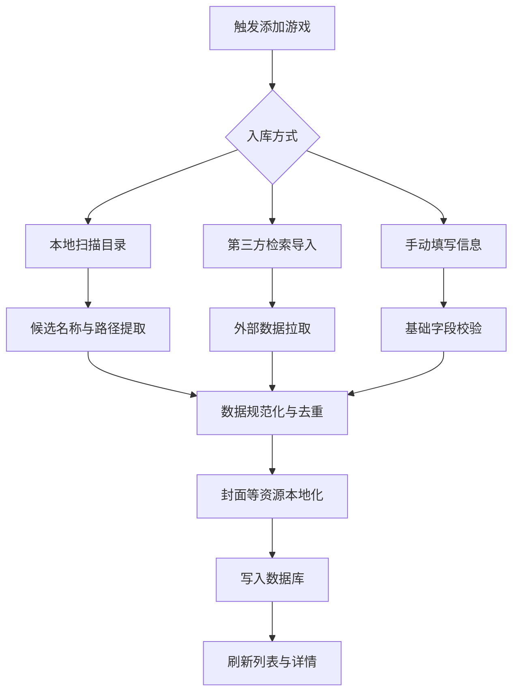
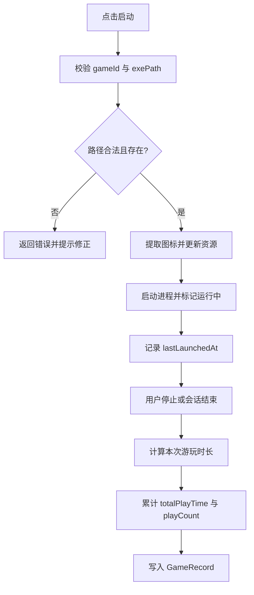
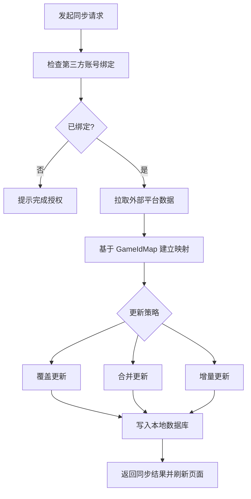
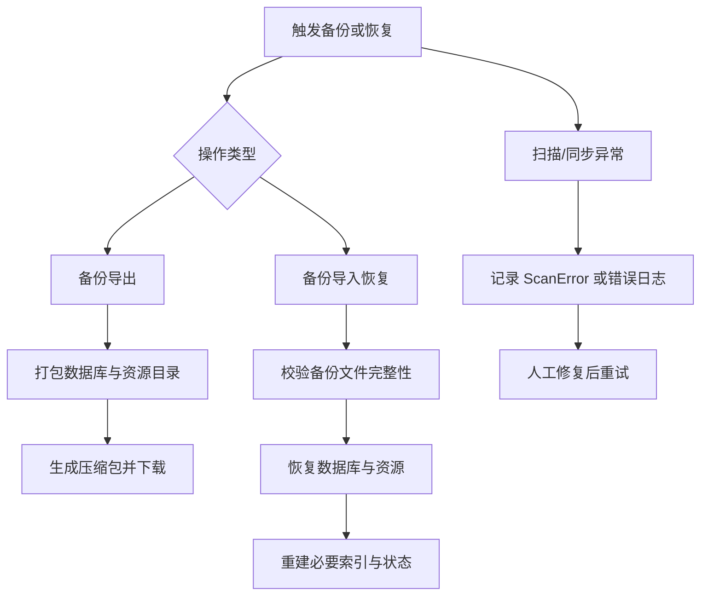
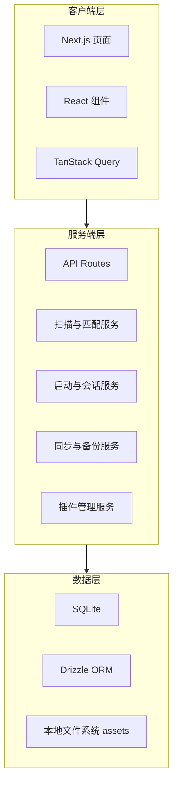
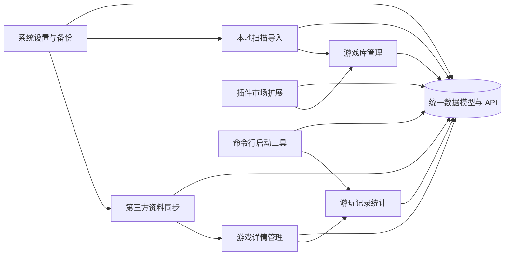
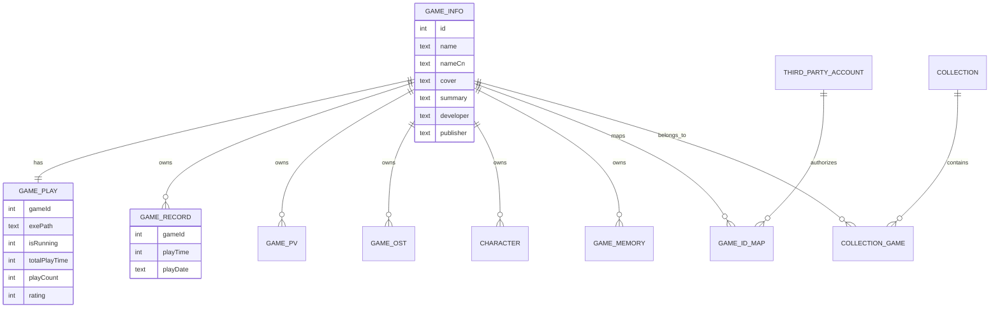
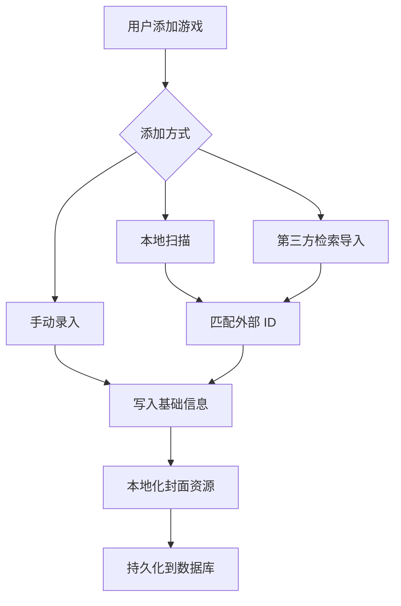
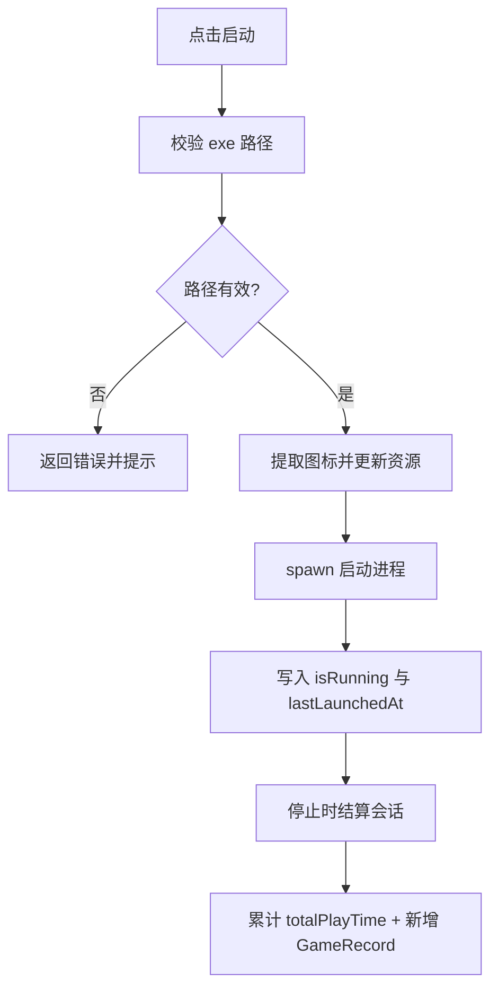
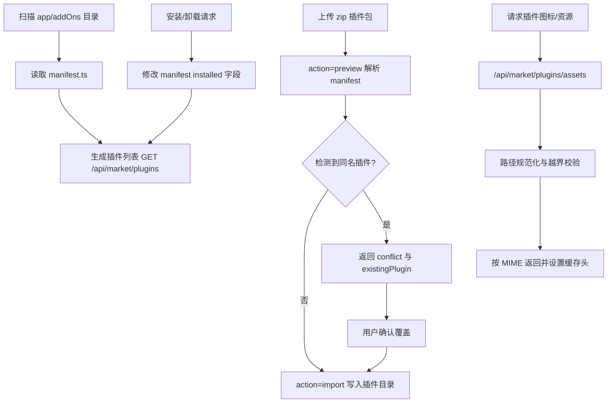

# 基于 Next.js 的视觉小说与本地游戏管理面板设计与实现

## 摘要

面向视觉小说与本地单机游戏的资料管理，传统文件夹方式普遍存在资源分散、元数据不完整、游玩记录缺失、跨来源信息难以关联等问题。针对上述痛点，本文基于 Next.js 16、React 19 与 TypeScript 设计并实现了 vnweb 系统。系统采用 B/S 架构，以 Next.js App Router 与 API Routes 统一前后端工程，使用 SQLite 与 Drizzle ORM 完成本地持久化，结合 TanStack Query 进行服务端状态管理，并围绕“游戏库管理、本地扫描导入、第三方资料同步、游玩记录统计、系统设置与插件扩展”构建完整业务闭环。实现层面，系统支持本地目录扫描与数据源匹配、可执行文件启动与会话结算、图像资源本地化缓存、Steam 时长同步、数据备份导出及插件导入安装等能力。测试阶段采用 Vitest 对 API 与工具模块进行验证。基于当前项目测试报告，系统语句覆盖率达到 56.40%，其中 API 子系统语句覆盖率达到 69.80%，能够较稳定地支撑本地游戏管理场景。本文工作验证了 Next.js 在本地工具型 Web 应用中的可行性，并为视觉小说垂类管理系统提供了可复用的工程实现参考。

**关键词**：视觉小说；游戏管理；Next.js；Drizzle ORM；SQLite；Vitest

---

## 1 绪论

### 1.1 研究背景与意义

随着数字发行平台与独立游戏生态的发展，玩家私有游戏库规模持续增长。对于视觉小说用户而言，单个游戏往往伴随封面、角色、PV、OST、攻略站点与游玩记录等多维资料，且这些信息分散在本地目录、社区数据库与外部平台中。仅依赖文件夹命名和快捷方式管理，不仅检索效率低，而且难以形成可维护的结构化档案。

在实际使用中，现有管理方式主要存在四类问题：

1. 资源分散：游戏可执行文件与资料分布在多个磁盘目录，缺少统一入口。
2. 资料维护成本高：封面、简介、角色信息等需要手工检索与录入。
3. 记录能力不足：游玩时长、启动次数、时间分布等行为数据难以连续沉淀。
4. 数据关联弱：不同平台 ID 与本地实体之间缺少稳定映射，易产生重复与冲突。

因此，构建一套面向视觉小说与本地单机游戏的 Web 化管理系统，具有明确的应用价值。一方面，可验证现代前端全栈框架在“本地工具软件”领域的适配能力；另一方面，可为轻量、跨平台、可扩展的个人游戏资料库建设提供实现路径。

### 1.2 国内外研究现状

国外已有 Playnite、LaunchBox 等成熟游戏库管理工具，通常具备启动管理、封面展示与平台整合能力，但多数偏桌面端且面向泛游戏场景，对视觉小说所需的角色、媒体与回忆等维度支持有限。国内相关项目多聚焦资料查询或平台导入，较少在“本地扫描、可执行启动、会话计时、统计分析、扩展插件”之间形成统一流程。

综合来看，现有方案仍存在以下改进空间：

1. Web 化程度不足，跨设备访问和统一部署成本较高。
2. 垂类能力不足，对视觉小说特有资料维度支持不完整。
3. 数据闭环不足，缺少从导入、管理、启动到统计的一体化流程。

### 1.3 研究目标与主要贡献

本文围绕“本地游戏资源统一管理”目标，完成系统分析、设计、实现与测试。主要贡献如下：

1. 提出一套面向视觉小说场景的数据模型，将游戏基础信息、角色、媒体、回忆、游玩记录与外部 ID 映射纳入统一实体体系。
2. 实现基于 Next.js API Routes 的本地工具型业务后端，形成扫描导入、资料同步、启动计时、统计分析等核心流程。
3. 设计并实现图像本地化、备份导出、代理配置、第三方账号同步与插件安装等工程化能力。
4. 构建 API 与工具模块测试体系，给出覆盖率与缺陷修复结果，为后续迭代提供质量基线。

### 1.4 论文结构

全文共七章：第一章为绪论；第二章给出需求分析；第三章介绍关键技术与可行性；第四章阐述系统设计；第五章说明系统实现；第六章给出测试与分析结果；第七章总结与展望。

---

## 2 需求分析

### 2.1 系统目标

系统目标是为视觉小说与本地单机游戏用户提供“可启动、可维护、可统计、可扩展”的统一管理面板。核心目标包括：

1. 建立本地游戏库索引并支持检索、筛选、排序与收藏组织。
2. 支持外部平台元数据同步，降低人工录入成本。
3. 记录游玩会话并提供周、月、年维度统计。
4. 提供系统级配置与数据备份，保证可持续使用。

### 2.2 用户与使用场景

系统主要面向三类用户：

1. 普通玩家：关注快速启动与基础浏览。
2. 收藏型用户：关注资料完整性、批量维护与精细筛选。
3. 记录型用户：关注游玩统计、周期变化与导出能力。

由于系统定位为个人本地工具，当前版本不引入多租户与权限分级设计。

### 2.3 功能需求

功能需求不仅回答系统“要实现什么”，还需说明“为何必须实现”。结合 1.1 节提出的痛点与 2.2 节用户画像，并与后续模块设计、实现章节保持同名映射，本文将功能需求细化为八类。

#### 2.3.1 游戏库管理

功能必要性：当本地游戏数量持续增长时，若缺少统一索引入口，用户需要在多级目录中反复查找可执行文件，检索成本高且易遗漏。因此，游戏库管理模块是系统的基础入口能力。

具体需求如下：

1. 提供统一列表视图，展示游戏基础信息与当前状态，支持快速进入详情页。
2. 支持关键词检索与多条件组合过滤，满足“按名称找游戏”与“按属性筛游戏”的不同检索场景。
3. 支持按名称、更新时间、游玩时长、评分等维度排序，提升大规模库下的浏览效率。
4. 支持批量操作与收藏夹管理，降低重复维护成本并支持个性化组织。
5. 提供从列表直接启动游戏的入口，缩短“查找-启动”的交互路径。

#### 2.3.2 游戏详情管理

功能必要性：视觉小说场景下，单一列表无法承载角色、媒体、回忆与记录等高密度信息。若无结构化详情页，资料长期维护将趋于碎片化与不可追溯。

具体需求如下：

1. 提供概览、角色、PV、OST、回忆、记录等分标签展示，支持多维信息的有序浏览。
2. 支持封面、背景、图标、Logo、可执行路径等核心字段编辑，保障元数据可持续维护。
3. 支持详情页内的资源更新与关联信息刷新，减少“多页面跳转维护”造成的操作负担。
4. 支持本地实体与外部来源信息的对照展示，便于后续同步冲突处理与人工校验。

#### 2.3.3 本地扫描导入

功能必要性：手工录入游戏信息在中大型游戏库中成本高、易出错且重复率高。自动化扫描导入是降低初始建库门槛、提升可用性的关键能力。

具体需求如下：

1. 支持按目录层级扫描与按可执行文件扫描两种模式，以适配不同磁盘组织习惯。
2. 支持扫描深度、排除目录等参数配置，避免无关目录导致的性能浪费与误识别。
3. 对候选名称与路径进行规范化、去重与有效性校验，提高入库质量。
4. 提供扫描进度反馈与处理中状态展示，保证长耗时任务可感知、可追踪。
5. 对失败项输出错误记录，支持后续人工修复与重试。

#### 2.3.4 第三方资料同步

功能必要性：游戏资料分散在多个平台，若完全依赖人工维护，不仅效率低，还会导致字段不一致与信息老化。第三方同步模块用于降低维护成本并提高资料完整度。

具体需求如下：

1. 支持接入 Steam、VNDB、Bangumi、SteamGridDB 等来源，完成检索与详情拉取。
2. 基于 GameIdMap 建立本地与外部 ID 的稳定映射，避免重复导入与错配。
3. 支持覆盖、合并、增量三类更新策略，以适应不同字段的维护偏好。
4. 支持同步结果回显与异常信息记录，便于用户判断更新效果并进行二次修正。
5. 支持账号绑定前置检查，确保仅在可授权状态下执行同步。

#### 2.3.5 游玩记录与统计

功能必要性：系统不仅需要“能管理”，还需要“能量化”。缺少记录与统计将使用户无法评估游玩投入，也无法支撑后续行为分析与决策。

具体需求如下：

1. 支持会话级启动计时与结束结算，形成最小粒度行为记录。
2. 支持总时长累计、启动次数统计与最近游玩时间更新，构建长期行为画像。
3. 支持周、月、年与总览等多时间粒度报表，满足周期性复盘需求。
4. 支持排行榜与时段分布展示，帮助用户识别偏好类型与游玩习惯。
5. 支持与第三方时长数据协同补全，提升统计结果的完整性。

#### 2.3.6 系统设置与备份

功能必要性：本地工具强调长期运行稳定性与个性化适配。若缺少系统设置与数据保障能力，系统在不同终端环境下的可用性和持续使用能力将显著下降。

具体需求如下：

1. 支持主题、字体、代理等系统参数配置，提升不同设备与网络环境下的可用性。
2. 支持第三方账号配置与状态管理，为资料同步与时长补全提供前置条件。
3. 支持数据库与资源目录的备份导出，满足迁移与归档需求。
4. 支持备份导入恢复与完整性校验，降低误操作或异常退出导致的数据损失风险。

#### 2.3.7 插件市场扩展

功能必要性：随着用户场景扩展，核心功能难以覆盖全部个性化需求。插件机制可在不破坏主系统稳定性的前提下实现能力增量接入。

具体需求如下：

1. 支持插件列表浏览与安装状态展示，形成可视化扩展入口。
2. 支持 zip 插件导入预览、冲突检测与覆盖确认，保障扩展接入过程可控。
3. 支持插件安装、卸载与启停状态切换，满足按需启用策略。
4. 支持插件静态资源的受控访问，保证扩展资源可用性与安全性。

#### 2.3.8 命令行启动工具

功能必要性：在低配置设备、远程终端或仅需快速启动的场景中，图形界面并非最优入口。命令行工具可提供更低开销的使用路径，并增强自动化接入能力。

具体需求如下：

1. 提供 list、search、open、start 等核心命令，覆盖“查询-定位-启动”最常见流程。
2. 支持命令行下的启动计时与会话结束结算，确保离开 Web 界面后仍可沉淀记录。
3. 与 Web 端共享统一数据模型与结算逻辑，保证跨入口数据一致性。
4. 支持键盘快捷交互完成启动与结束操作，降低频繁切换界面的时间成本。

### 2.4 非功能需求

非功能需求用于约束系统质量属性，确保系统不仅“能用”，而且“好用、稳定、可持续演进”。结合 vnweb 的定位，本文将非功能需求细化如下。

#### 2.4.1 易用性需求

1. 界面层面应支持桌面端与移动端的响应式布局，核心操作路径保持一致。
2. 高频操作（搜索、筛选、启动、查看统计）应在三步以内完成，减少交互负担。
3. 关键页面应提供明确反馈，包括加载状态、错误提示、空数据提示与成功提示。

#### 2.4.2 性能需求

1. 游戏列表、详情与统计查询应采用缓存与增量更新策略，避免重复请求。
2. 扫描、导入、备份等耗时操作应支持进度反馈与异步执行，避免阻塞主交互。
3. 大规模游戏库场景下，系统应保持可接受的响应时间与滚动流畅度。
4. 应提供无浏览器运行的命令行模式，以降低低配置设备下的内存占用。

#### 2.4.3 可靠性需求

1. API 层需具备参数校验、异常捕获与统一错误返回，防止无效输入导致系统失稳。
2. 会话计时、时长累加、记录写入等关键流程应保证数据一致性。
3. 系统应提供数据备份与恢复能力，降低误操作或异常退出带来的数据损失风险。

#### 2.4.4 安全与隐私需求

1. 对路径、插件标识、上传内容等输入进行合法性校验，降低路径注入与非法访问风险。
2. 第三方账号令牌与代理配置需受控存储，避免在前端暴露敏感信息。
3. 本地文件访问应遵循最小权限原则，仅开放必要目录与受控接口。

#### 2.4.5 可维护性与可测试性需求

1. 采用“页面-组件-路由-数据访问”分层结构，降低模块耦合度。
2. 核心业务逻辑应沉淀为可复用工具函数，便于测试和重构。
3. 需持续构建测试用例并输出覆盖率，为版本迭代提供质量基线。

#### 2.4.6 可扩展性与兼容性需求

1. 系统应通过插件市场与 manifest 机制支持新功能增量接入。
2. 在保持 Windows 本地能力优势的同时，逐步降低平台耦合，提升跨平台兼容性。
3. 数据模型应预留外部 ID 映射与来源扩展字段，支持新增第三方数据源。

### 2.5 系统结构分析

从需求视角，vnweb 可抽象为“表现层、业务层、数据层、本地能力层”四层结构。

1. 表现层：由 Next.js 页面与 React 组件构成，负责信息展示与交互编排。
2. 业务层：由 API Routes 与领域服务组成，负责扫描、同步、计时、统计、备份等业务处理。
3. 数据层：以 SQLite 为核心，通过 Drizzle ORM 提供类型安全访问与持久化。
4. 本地能力层：封装可执行文件启动、图标提取、字体读取、文件系统访问等能力。

该结构能够将“界面变化”与“业务规则变化”解耦，既满足当前个人工具场景，也便于后续功能扩展。

### 2.6 业务流程分析

围绕核心使用场景，系统业务流程可归纳为以下四类。


图 2-1 系统核心业务流程总览

#### 2.6.1 游戏入库流程

用户可通过本地扫描、第三方检索或手动录入添加游戏。系统在写入数据库前执行数据规范化与去重，并对封面等媒体资源执行本地化缓存。



图 2-2 游戏入库流程图

#### 2.6.2 启动与计时流程

用户点击启动后，系统校验可执行路径并创建会话状态；用户停止或会话结束时，系统计算本次时长并写入记录表，同时累计总时长与启动次数。



图 2-3 启动与计时流程图

#### 2.6.3 第三方同步流程

系统通过账号绑定获取外部平台数据，利用 GameIdMap 建立本地与外部 ID 关系，再执行覆盖、合并或增量更新策略，确保资料一致性。



图 2-4 第三方同步流程图

#### 2.6.4 数据保障流程

系统支持将数据库与资源目录打包导出，用于迁移与恢复；当出现导入、扫描或同步异常时，系统记录失败项并支持后续修复。



图 2-5 数据保障流程图

### 2.7 开发运行环境

系统开发与运行环境分为“当前开发配置”“最低版本配置要求”和“推荐配置要求”三部分。

#### 2.7.1 当前开发配置

| 类别 | 当前配置 |
| --- | --- |
| 开发操作系统 | Windows 11 |
| Node.js | 20.19.0 |
| 包管理工具 | npm 10+ |
| 核心框架 | Next.js 16.1.6 + React 19.2.3 |
| 样式与组件 | Tailwind CSS 4 + shadcn/ui |
| 数据库与 ORM | SQLite + Drizzle ORM |
| 测试工具 | Vitest 4（Node/Browser 双项目） |
| 浏览器环境 | Microsoft Edge（浏览器测试） |

#### 2.7.2 最低版本配置要求

| 组件 | 最低版本要求 | 说明 |
| --- | --- | --- |
| 操作系统 | Windows 10 x64（22H2）及以上，或 Ubuntu 22.04 LTS 及以上，或 macOS 13 及以上 | Linux/macOS 环境需补充本地能力适配层（进程监控、图标/缩略图提取、字体读取、路径处理） |
| Node.js | 20.0.0 及以上 | 与项目 Node 20+ 依赖约束保持一致 |
| npm | 10.0.0 及以上 | 用于安装并管理项目依赖 |
| Web 浏览器 | Edge 120 及以上，或同内核版本浏览器 | 用于浏览器侧测试与页面功能验证 |
| SQLite | 3.0 及以上 | 项目使用 SQLite 文件数据库进行本地持久化 |

其中，Windows 方案为当前已验证实现；Linux 与 macOS 在补齐本地能力适配模块后，可满足同等最低部署要求。

#### 2.7.3 推荐配置要求

为保证本系统在开发、测试与日常使用中的稳定性，建议采用如下推荐配置。

| 组件 | 推荐配置 | 说明 |
| --- | --- | --- |
| 操作系统 | Windows 11 x64（23H2）及以上，或 Ubuntu 24.04 LTS 及以上，或 macOS 14 及以上 | Windows 为当前实测环境；Linux/macOS 需启用对应本地能力适配层 |
| Node.js | 20.19.0（LTS）及以上 | 与本项目实际开发版本一致，兼容性最佳 |
| npm | 10.8.0 及以上 | 依赖解析与安装稳定性更好 |
| Web 浏览器 | Edge 130 及以上，或 Chrome 130 及以上，或 Safari 17 及以上 | 保证前端特性与调试工具兼容性 |
| CPU | 4 核及以上 | 提升构建、测试与扫描任务执行效率 |
| 内存 | 16 GB 及以上 | 保证开发服务、浏览器与数据库并行运行时的流畅性 |
| 磁盘 | 预留 20 GB 及以上可用空间（SSD） | 用于依赖安装、数据库文件、资源缓存与测试报告 |
| 网络 | 稳定宽带连接（建议 20 Mbps 及以上） | 用于第三方数据源同步与依赖下载 |

关键环境变量包括 DB_FILE_NAME、STEAM_API_KEY 及第三方 OAuth 配置。开发阶段主要使用 npm run dev 启动服务，测试阶段使用 npm run test 与 npm run test:coverage 输出质量指标。

---

## 3 关键技术与可行性分析

### 3.1 Next.js 16

1. 技术概念：Next.js 是基于 React 的全栈框架，提供文件路由、服务端渲染、静态生成与 API Routes 等能力。
2. 优势与特点：统一前后端工程结构、路由约定清晰、生态成熟，适合快速构建数据驱动型应用。
3. 项目作用：vnweb 使用 App Router 组织页面，使用 API Routes 承载扫描、同步、启动、统计与设置等接口逻辑，减少前后端拆分成本。

### 3.2 React 19

1. 技术概念：React 是组件化 UI 库，通过声明式渲染与状态驱动更新组织复杂界面。
2. 优势与特点：组件复用能力强、生态丰富、可维护性高，适合构建高交互密度界面。
3. 项目作用：系统中的游戏卡片、详情标签页、统计面板、设置面板等均采用组件化方式实现，提升了界面复用与迭代效率。

### 3.3 TypeScript

1. 技术概念：TypeScript 是 JavaScript 的超集，通过静态类型系统增强代码可分析性。
2. 优势与特点：可在编译阶段发现类型错误，提升大型项目重构安全性与接口一致性。
3. 项目作用：系统在 API 入参、数据库实体、业务模型与组件 props 层面使用类型约束，降低运行时错误概率。

### 3.4 TanStack Query 与 Jotai

1. 技术概念：TanStack Query 用于管理服务端状态，Jotai 用于轻量客户端原子状态管理。
2. 优势与特点：前者具备缓存、失效与请求重试机制，后者具备低样板代码与高组合性。
3. 项目作用：游戏列表、详情、统计等接口数据由 TanStack Query 管理；局部交互态与跨组件状态由 Jotai 协同维护。

### 3.5 SQLite

1. 技术概念：SQLite 是嵌入式关系型数据库，数据以单文件形式存储。
2. 优势与特点：部署成本低、无需独立数据库服务、事务能力完整，适合本地应用。
3. 项目作用：vnweb 使用 SQLite 保存游戏信息、游玩记录、扫描配置、账号映射与插件相关数据，满足本地持久化需求。

### 3.6 Drizzle ORM

1. 技术概念：Drizzle ORM 是面向 TypeScript 的轻量 ORM，支持以代码定义 Schema 与类型安全查询。
2. 优势与特点：类型推断能力强、SQL 表达接近原生、迁移管理清晰，兼顾开发效率与可控性。
3. 项目作用：项目通过 Drizzle 定义 game_info、game_play、game_record 等核心表，并通过统一查询接口实现业务数据访问。

### 3.7 Tailwind CSS 4 与 shadcn/ui

1. 技术概念：Tailwind CSS 是原子化 CSS 框架，shadcn/ui 是基于 Radix 的可组合组件方案。
2. 优势与特点：前者提升样式开发效率，后者提供可访问、可定制的基础组件，二者结合可形成一致设计体系。
3. 项目作用：系统使用该组合实现导航、表单、对话框、标签页与图表容器等界面模块，保证视觉与交互一致性。

### 3.8 Recharts

1. 技术概念：Recharts 是基于 React 的图表库，支持折线图、柱状图、面积图等常见统计图形。
2. 优势与特点：组件化图表定义简洁，便于与 React 状态系统联动，适合中小规模数据可视化。
3. 项目作用：系统在记录总览、周报、月报、年报中使用 Recharts 呈现时长趋势、时段分布与排行对比。

### 3.9 Vitest

1. 技术概念：Vitest 是基于 Vite 生态的现代测试框架，支持单元测试、组件测试与覆盖率统计。
2. 优势与特点：启动速度快、与 TypeScript 兼容性好、支持 Node 与浏览器双环境。
3. 项目作用：项目利用 Vitest 验证 API 路由和工具模块逻辑，并产出覆盖率报告，为质量评估与回归验证提供依据。

### 3.10 Windows 本地能力封装

1. 技术概念：本地能力封装是将操作系统相关功能以独立模块形式对外提供统一调用接口。
2. 优势与特点：可将平台相关细节与业务逻辑解耦，既保留本地能力，又降低调用复杂度。
3. 项目作用：系统通过该封装实现可执行文件图标提取、进程状态检查、字体读取与文件路径处理，满足本地游戏管理场景需求。

### 3.11 技术可行性小结

从工程实践看，上述技术组合具备成熟生态与较低实现门槛：Next.js 与 React 提供统一全栈框架，SQLite 与 Drizzle 支撑本地数据闭环，TanStack Query 与 Vitest 提供状态与质量保障能力，能够满足 vnweb 在“本地优先、资料整合、可持续迭代”方面的建设目标。

---

## 4 系统设计

### 4.1 总体架构

系统采用客户端层、服务端层、数据层三层结构。



### 4.2 功能模块设计

为将需求阶段提出的业务能力落地到可实现、可维护的系统结构，vnweb 在功能层面划分为八个核心模块：游戏库管理、游戏详情管理、本地扫描导入、第三方资料同步、游玩记录统计、系统设置与备份、插件市场扩展、命令行启动工具。各模块通过 API Routes 与统一数据模型协同，形成清晰的数据流与职责边界。



图 4-1 功能模块关系图

各功能模块的具体划分如下。

| 模块 | 主要职责 | 具体功能 |
| --- | --- | --- |
| 游戏库管理模块 | 管理本地游戏条目与入口组织 | 提供列表展示、关键词检索、多条件筛选、排序切换、收藏夹归类、批量操作与快速启动入口。 |
| 游戏详情管理模块 | 维护单游戏的结构化信息 | 提供概览、角色、PV、OST、回忆、记录等标签页；支持封面、背景、图标、Logo、可执行路径等字段编辑与资源更新。 |
| 本地扫描导入模块 | 从本地目录建立候选游戏集合 | 支持按目录层级扫描与按可执行文件扫描；支持深度限制、排除目录、候选名提取、去重、进度跟踪与失败项记录。 |
| 第三方资料同步模块 | 将外部平台数据映射到本地实体 | 支持 Steam、VNDB、Bangumi、SteamGridDB 等来源的数据检索与字段映射；支持 GameIdMap 关联、覆盖/合并/增量更新与异常重试。 |
| 游玩记录统计模块 | 记录会话行为并输出分析结果 | 提供启动计时、会话结算、总时长累计、启动次数统计；支持周/月/年与总览报表、排行榜和时段分布图。 |
| 系统设置与备份模块 | 提供可持续运行的系统级配置能力 | 支持主题、字体、代理、第三方账号配置；支持数据库与资源目录备份导出、备份导入恢复与数据迁移。 |
| 插件市场扩展模块 | 提供系统能力增量扩展机制 | 支持插件列表浏览、zip 导入预览、安装/卸载、安装状态切换、资源代理访问与 manifest 管理。 |
| 命令行启动工具模块 | 在低开销场景下提供轻量操作入口 | 支持 list、search、open、start 等命令；支持命令行启动计时与按键结束会话，保证与 Web 模式共享同一结算与记录逻辑。 |

为保证第 2 章需求定义、第 4 章模块设计与第 5 章实现叙述在术语层面严格一一对应，本文采用“同名模块 + 单实现锚点”策略，统一映射关系如表 4-2 所示。

| 需求章节（第 2 章） | 设计模块（第 4 章） | 实现章节（第 5 章） | 项目实现锚点（接口/目录） |
| --- | --- | --- | --- |
| 2.3.1 游戏库管理 | 游戏库管理模块 | 5.8 游戏库管理与多模块界面交互实现 | `app/game/page.tsx`、`components/layout/app-header.tsx`（搜索与筛选交互） |
| 2.3.2 游戏详情管理 | 游戏详情管理模块 | 5.2 游戏详情管理与启动会话结算实现 | 启动与结算流程（`GamePlayTable`、`GameRecordTable` 更新逻辑） |
| 2.3.3 本地扫描导入 | 本地扫描导入模块 | 5.3 本地扫描与元数据匹配实现 | 扫描链路（`ScannerTable` 进度更新、`ScanErrorTable` 失败记录） |
| 2.3.4 第三方资料同步 | 第三方资料同步模块 | 5.4 第三方同步与记录补全实现 | 同步映射链路（`GameIdMapTable`、Steam 时长增量补全） |
| 2.3.5 游玩记录与统计 | 游玩记录统计模块 | 5.5 游玩记录统计与报表实现 | `app/record/overview/page.tsx`、`components/record/record-period-panel.tsx` |
| 2.3.6 系统设置与备份 | 系统设置与备份模块 | 5.6 系统设置与数据备份实现 | 设置与备份能力（`lib/background-settings.ts`、`lib/font-settings.ts`、备份归档接口） |
| 2.3.7 插件市场扩展 | 插件市场扩展模块 | 5.7 插件市场扩展实现 | `app/api/market/plugins/*`、`app/addOns/*`、`app/market/page.tsx` |
| 2.3.8 命令行启动工具 | 命令行启动工具模块 | 5.9 命令行启动工具实现 | `cmd/tui.ts`（命令分发、启动计时、会话结算） |

表 4-2 需求-设计-实现术语映射

### 4.3 数据模型设计

核心实体围绕 GameInfo 构建，并扩展 GamePlay、GameRecord、Character、GamePv、GameOst、GameMemory、Collection、GameIdMap、ThirdPartyAccount、Scanner 等子域。



### 4.4 关键业务流程设计

#### 4.4.1 游戏添加流程



#### 4.4.2 启动与计时流程



### 4.5 安全与可靠性设计

1. 输入校验：对主键、路径、插件 ID、扫描参数进行格式与范围校验。
2. 资源隔离：媒体资源存放于受控目录并通过 API 访问。
3. 异常处理：关键路由统一返回结构化错误信息，保证前端可恢复。
4. 数据一致性：会话结算采用“更新游玩总时长 + 插入记录”组合写入策略。

---

## 5 系统实现

### 5.1 开发环境与工程组织

系统基于 Node.js 20+ 环境开发，采用 TypeScript 全栈实现。核心目录包括：

1. app：页面路由与 API Routes。
2. components：业务组件与通用 UI。
3. db 与 drizzle：数据模型与迁移文件。
4. lib：通用工具、同步逻辑与服务封装。
5. win：Windows 本地能力实现。

为与第 2 章和第 4 章术语保持一致，本章实现部分采用与功能模块同名的组织方式：5.2 对应游戏详情管理，5.3 对应本地扫描导入，5.4 对应第三方资料同步，5.5 对应游玩记录统计，5.6 对应系统设置与备份，5.7 对应插件市场扩展，5.8 对应游戏库管理界面交互，5.9 对应命令行启动工具。

### 5.2 游戏详情管理与启动会话结算实现

本节对应第 4 章“游戏详情管理模块”中的启动链路，同时为“游玩记录统计模块”提供会话原始数据。

在详情管理层，系统以游戏详情页为中心组织概览、角色、PV、OST、回忆、记录等信息分区，并支持封面、背景、图标、Logo、可执行路径等关键字段的维护。该设计使“资料展示”与“可执行启动”在同一上下文中完成，减少用户在多页面往返造成的维护成本。

启动接口首先校验 gameId 与可执行路径，随后执行以下动作：

1. 规范化 Windows 路径并检查文件存在性。
2. 从 exe 提取图标并复制到公开资源目录。
3. 使用 detached 模式启动进程。
4. 写入 isRunning=1 与 lastLaunchedAt。

结束接口调用会话结算函数，完成总时长累计、启动次数递增及记录落库。会话时长计算如下：

$$
T_{session}=\max\left(0,\left\lfloor\frac{t_{end}-t_{start}}{1000}\right\rfloor\right)
$$

总时长更新表达为：

$$
T_{total}^{new}=T_{total}^{old}+T_{session}
$$

核心代码示例如下。

```typescript
// 启动进程并写入运行状态
const child = spawn(finalExePath, [], {
  detached: true,
  stdio: 'ignore',
  windowsHide: false,
})
child.unref()

await db
  .update(GamePlayTable)
  .set({
    exePath: finalExePath,
    isRunning: 1,
    lastLaunchedAt: launchedAt,
  })
  .where(eq(GamePlayTable.id, currentPlay.id))
```

代码 5-1 启动与运行状态写入

```typescript
// 会话结束后累计总时长并写入分段记录
const elapsedSeconds = safeDiffSeconds(play.lastLaunchedAt || '', endedAt)

await db
  .update(GamePlayTable)
  .set({
    totalPlayTime: sql`${GamePlayTable.totalPlayTime} + ${elapsedSeconds}`,
    playCount: sql`${GamePlayTable.playCount} + 1`,
    lastLaunchedAt: endedAtIso,
    isRunning: 0,
  })
  .where(eq(GamePlayTable.id, play.id))

await db.insert(GameRecordTable).values({
  gameId,
  playTime: elapsedSeconds,
  playDate: play.lastLaunchedAt || endedAtIso,
})
```

代码 5-2 会话结算与记录落库

### 5.3 本地扫描与元数据匹配实现

本节对应第 4 章“本地扫描导入模块”，实现候选发现、匹配入库与扫描进度管理。

扫描模块支持两种模式：

1. 层级扫描：按设定层级收集候选目录名。
2. 可执行文件扫描：递归查找包含 exe 的目录。

当前自动扫描支持 bangumi 与 steamgriddb 两类 provider。系统对候选名称执行检索、详情拉取与字段映射，并将封面等远程图片本地化后写入数据库。扫描过程中按处理数量实时更新 progress，并将失败项写入 ScanError 表。

核心代码示例如下。

```typescript
for (const name of uniqueCandidates) {
  try {
    const matchedId = await searchByProvider(scanner.provider, name)
    if (matchedId) {
      const gameInfo = await fetchGameInfoByProvider(scanner.provider, matchedId)
      if (gameInfo) {
        await saveGameInfo(gameInfo, scanner.provider, matchedId)
      }
    }
  } catch (error) {
    await db.insert(ScanErrorTable).values({
      directory: scanner.directory,
      error: `${name}: ${(error as Error).message}`,
      status: 0,
      createdAt: now,
      updatedAt: now,
    })
  }

  processed += 1
  const progress = Math.min(100, Math.floor((processed / uniqueCandidates.length) * 100))
  await db
    .update(ScannerTable)
    .set({ progress, gameCount: totalCount, updatedAt: dayjs().toISOString() })
    .where(eq(ScannerTable.id, scannerId))
}
```

代码 5-3 扫描匹配与进度更新

### 5.4 第三方同步与记录补全实现

本节对应第 4 章“第三方资料同步模块”，实现外部账号数据映射与本地记录补全。

系统支持绑定第三方账号，并提供 Steam 时长同步接口。同步流程如下：

1. 读取绑定 Steam 账号与 API Key。
2. 拉取 owned games 的累计时长。
3. 通过 GameIdMap 建立 appId 到 gameId 映射。
4. 计算增量时长并补写 GameRecord。

该设计将“平台累计时长”转化为“本地可分析记录”，保证统计模块可用。

核心代码示例如下。

```typescript
// 建立 Steam appId 到本地 gameId 的映射
const importedGames = await db
  .select({
    gameId: GameIdMapTable.gameId,
    externalId: GameIdMapTable.externalId,
  })
  .from(GameIdMapTable)
  .where(eq(GameIdMapTable.provider, 'steam'))

const appIdToGameId = new Map<string, number>()
for (const game of importedGames) {
  appIdToGameId.set(game.externalId, game.gameId)
}

// 计算增量并写入总时长与分段记录
const previousTotal = Math.max(0, Number(existingRecord[0]?.totalPlayTime || 0))
const deltaSeconds = hasTimerRecord ? playtimeSeconds - previousTotal : playtimeSeconds

await db
  .update(GamePlayTable)
  .set({
    totalPlayTime: playtimeSeconds,
    ...(deltaSeconds > 0 ? { lastLaunchedAt: syncEndedAtIso } : {}),
  })
  .where(eq(GamePlayTable.gameId, gameId))

if (deltaSeconds > 0) {
  const startAt = syncEndedAt.subtract(deltaSeconds, 'second')
  await db.insert(GameRecordTable).values({
    gameId,
    playDate: startAt.toISOString(),
    playTime: deltaSeconds,
  })
}
```

代码 5-5 第三方时长同步与增量入库

### 5.5 游玩记录统计与报表实现

本节对应第 4 章“游玩记录统计模块”中的数据分析能力。

为保证统计结果既“可计算”又“可读懂”，本项目将该模块拆分为“接口聚合层 + 前端展示层”两部分：

1. 接口聚合层负责把离散的游玩记录整理成可直接展示的数据结构。
2. 前端展示层负责将同一份数据映射为总览卡片、趋势图和排行榜。

该模块在实现上主要使用以下技术栈：

1. Next.js API Routes：提供统计接口，按“总览、时间线、月报、年报”组织服务端计算逻辑。
2. Drizzle ORM：以类型安全方式读取本地持久化数据，避免手写 SQL 带来的维护成本。
3. dayjs：统一处理日期解析、周期边界计算与时间格式化，保证周/月/年统计口径一致。
4. Axios（封装于 request-utils）+ TanStack Query：完成前端请求、缓存复用与重试控制，减少重复加载。
5. Recharts：将聚合后的结果渲染为柱状图、折线图、饼图和排行榜卡片。

从处理流程看，统计模块可概括为“四步法”。

第一步，时间区间标准化。前端在用户切换“本周、本月、本年”或点击上一周期时，会将周期类型与偏移量传给接口；服务端使用 dayjs 计算对应起止时间，并统一输出可读标签（例如“2026 年 03 月”）。这样做可以保证不同页面在时间口径上完全一致。

第二步，原始记录聚合。服务端不直接返回原始记录，而是先按统计目标进行分桶计算。例如：总览页侧重“总体规模 + 时段分布 + 排行”；周期页侧重“按天或按月的趋势变化 + 活跃天数 + 峰值时段”。聚合阶段会过滤无效时间并将时长统一换算为小时，降低前端二次处理复杂度。

第三步，结果结构化输出。接口返回的不是“数据库视角”数据，而是“图表视角”数据：每个数据点都包含可直接绑定到图表组件的标签和值。该设计使前端可以复用同一套图表组件，分别渲染年度趋势、月度趋势与分布图，提升模块可维护性。

第四步，前端缓存与可视化。页面通过 TanStack Query 的 queryKey 管理不同报表请求，在周期切换时只刷新必要数据，并保留加载与重试状态；图表层基于 Recharts 完成折线/柱状切换、分布饼图展示与悬浮提示格式化，使“统计结果”可被直观解释，而不仅是数值堆叠。

在交互设计上，统计页采用“先总后分、逐层下钻”的信息组织方式：

1. 总览页先给出总时长、游玩天数、启动次数等关键指标，再给出全年月份分布和全天时段分布。
2. 年报页强调宏观变化，支持查看月度时长曲线、活跃天数变化、类型/发行方分布和年度排名。
3. 月报页强调短周期复盘，提供每日趋势、当月高频游戏与当月时长排名。

上述实现使统计模块形成了“记录采集-周期聚合-图表表达-交互复盘”的完整闭环。对于不了解项目内部数据结构的读者，也可直接从页面中理解用户在不同时间尺度下的游玩行为变化。

### 5.6 系统设置与数据备份实现

本节对应第 4 章“系统设置与备份模块”，实现运行参数个性化配置与数据保障能力。

在系统设置方面，项目提供主题、字体、背景样式、代理与第三方账号配置等能力，使系统能够在不同终端与网络环境下保持稳定可用。在数据保障方面，系统支持数据库与关键资源目录的备份导出和恢复迁移，降低异常退出或误操作导致的数据风险。

具体实现上，设置能力通过独立配置模块进行持久化与应用，例如背景配置、字体配置与玻璃效果配置分别由对应设置工具模块管理；界面层在应用启动与配置变更时同步读取并即时生效，从而保证参数修改后的可感知反馈。

备份接口支持将数据库文件与关键 assets 子目录（cover、bg、icon、logo、ost、characters、pv）打包为 zip，便于迁移与恢复。

核心代码示例如下。

```typescript
const archive = archiver('zip', { zlib: { level: 9 } })

// 1) 导出数据库
const dbPath = getDbPath()
if (fs.existsSync(dbPath)) {
  const dbBuffer = fs.readFileSync(dbPath)
  archive.append(dbBuffer, { name: 'database/local.db' })
}

// 2) 导出资源目录
const assetsPath = getAssetsPath()
if (fs.existsSync(assetsPath)) {
  for (const dir of ASSET_DIRS) {
    const dirPath = path.join(assetsPath, dir)
    if (fs.existsSync(dirPath)) {
      archive.directory(dirPath, `assets/${dir}`)
    }
  }
}

// 3) 导出元信息并完成归档
archive.append(JSON.stringify(backupInfo, null, 2), { name: 'backup-info.json' })
await new Promise<void>((resolve, reject) => {
  archive.on('end', () => resolve())
  archive.on('error', (err: Error) => reject(err))
  archive.finalize()
})
```

代码 5-6 备份压缩包构建与导出

### 5.7 插件市场扩展实现

本节对应第 4 章“插件市场扩展模块”，实现插件发现、导入、启停与资源访问。

为在“可扩展性”与“本地工具可维护性”之间取得平衡，系统采用“目录约定 + manifest 声明 + API 编排”的插件机制。插件以目录形式存放于 `app/addOns/{pluginId}`，通过 `manifest.ts` 声明 `id`、`name`、`version`、`icon`、`authors`、`installed` 等元数据，再由市场 API 完成发现、导入、安装状态切换与资源代理访问。



图 5-3 插件市场核心实现流程

从实现机制看，插件市场的关键原理包括以下四点。

1. 插件发现机制：系统遍历 `app/addOns` 下子目录，读取 `manifest.ts` 并提取元数据，形成统一插件列表。该方式以文件系统为单一事实来源，避免了额外注册中心维护。
2. 两阶段导入机制：`POST /api/market/plugins/import` 先执行 `preview` 再执行 `import`。预览阶段完成压缩包解析、ID 合法性校验与冲突检测；导入阶段在用户确认后写入目录，降低误覆盖风险。
3. 轻量安装机制：安装与卸载通过 `POST /install`、`POST /uninstall` 将 `manifest.ts` 中 `installed` 字段置为 `true/false` 完成状态切换，避免复杂依赖安装流程。
4. 受控资源访问机制：插件图标与静态资源统一经 `/api/market/plugins/assets/[...path]` 访问，服务端执行路径规范化与根目录约束，降低路径穿越带来的安全风险。

与常见插件系统相比，本项目方案在本地个人工具场景下具有更高的适配性。对比如表 5-2 所示。

| 对比维度 | 本项目插件机制（目录 + manifest + API） | 依赖管理驱动插件机制（包管理器安装） | 平台级中心化插件机制（在线商店） |
| --- | --- | --- | --- |
| 接入门槛 | 以 zip 与目录为核心，接入路径短 | 需要处理依赖安装与版本联动 | 需对接商店流程与审核策略 |
| 本地离线能力 | 支持本地导入与本地资源访问 | 依赖安装阶段通常需要联网 | 依赖中心化服务可用性 |
| 元数据可读性 | manifest 字段直观，可直接审查 | 元数据分散于包配置与运行时 | 依赖平台侧协议与后台配置 |
| 运行维护成本 | 以文件为边界，便于排错与回滚 | 依赖树复杂时维护成本上升 | 平台能力强但系统复杂度高 |
| 适配场景 | 个人本地工具、小团队垂类系统 | 需要生态复用的大型工程 | 面向大规模分发的平台产品 |

综合而言，本项目插件机制的优势在于：以较低工程复杂度实现了“可发现、可导入、可启停、可访问”的最小可用扩展闭环，能够满足 vnweb 当前阶段的扩展需求。相较具备签名校验、权限沙箱的工业级插件平台，该方案在隔离深度上仍有提升空间，后续可进一步引入权限声明与签名校验机制。

### 5.8 游戏库管理与多模块界面交互实现

本节以第 4 章“游戏库管理模块”为核心，对“游戏详情管理模块”“游玩记录统计模块”的前端呈现进行统一说明。

结合项目实际，游戏库主入口由 `app/game/page.tsx` 承载，顶部搜索与筛选操作由 `components/layout/app-header.tsx` 统一编排，侧边导航由 `components/layout/app-sidebar.tsx` 实现。该组织方式将“全局导航、列表检索、模块跳转”分层处理，使游戏库既可作为高频操作入口，也可作为其他模块的流量汇聚点。

界面设计遵循“高频任务优先、信息分层呈现、跨终端一致体验”的原则，在结构与交互层面进行针对性设计。

首先，在信息架构上采用“左侧导航 + 顶部工具栏 + 右侧内容区”三段式布局。左侧导航承担模块级切换（游戏、记录、扫描、插件市场、设置），顶部工具栏承载全局高频动作（返回/前进、搜索、筛选、主题切换），右侧内容区负责当前任务内容展示。该分层能够将“导航行为”与“内容操作”解耦，减少用户在多任务切换时的认知负荷。

其次，在导航交互上，系统采用图标化侧边栏并对已安装插件进行动态注入展示。其设计动因在于：

1. 图标化导航可在保证可识别性的同时降低横向空间占用，为主内容区保留更多展示面积。
2. 已安装插件仅在安装后进入侧边栏，避免未启用功能干扰主流程，保持界面简洁度。
3. 移动端通过 Sheet 抽屉模式承载侧边栏，避免小屏下固定导航挤压内容区域，提高可读性与可操作性。

再次，在任务流交互上，系统对高风险与长流程操作设置了分阶段反馈机制。以插件导入为例，界面先展示压缩包解析结果与版本信息，再在冲突场景下弹出覆盖确认对话框；以记录页为例，采用“总览/年报/月报/导出”分标签组织，先呈现关键指标卡片，再下钻图表与排行，符合“先总后分”的阅读与决策习惯。

此外，在视觉与反馈设计上，系统保持统一组件语义（Card、Tabs、Badge、Dialog），并提供加载骨架屏、空状态提示与 toast 反馈，确保用户在“加载中、无数据、操作成功/失败”等关键状态下均能获得明确系统响应。主题切换与背景样式配置进一步支持个性化使用场景，提升长期使用时的舒适度。

综上，界面与交互设计并非单纯追求视觉美观，而是围绕任务效率、错误预防与连续使用体验展开：通过结构分层降低认知成本，通过状态反馈降低操作不确定性，通过响应式与主题策略提升不同终端与不同用户偏好下的可用性。

### 5.9 命令行启动工具实现

本节对应第 4 章“命令行启动工具模块”，实现轻量入口下的启动与记录一致性。

除 Web 界面外，系统还实现了基于 Node.js 的命令行工具入口，支持 list、search、open、start 等核心命令。命令行模式可直接读取本地数据库并触发游戏启动与计时，在用户不打开浏览器的情况下完成轻量化使用。启动后支持按键结束会话并调用统一结算逻辑写入游玩记录，从而保证命令行与 Web 模式下的数据一致性。该模式在低内存环境中可减少前端渲染开销，提升运行效率。

核心代码示例如下。

```typescript
// 命令分发
if (cmd === 'start') {
  await startGame(sub || '')
  return
}

// 启动并进入命令行计时
const child = spawn(finalExePath, [], {
  detached: true,
  stdio: 'ignore',
  windowsHide: false,
})
child.unref()

process.stdin.on('keypress', async (_str, key) => {
  if (key.name === 'q') {
    await finalizeGameSession(game.id)
    process.exit(0)
  }
})
```

代码 5-4 命令行启动与结束计时

---

## 6 系统测试与结果分析

### 6.1 测试目标与方法

测试目标是验证系统在核心业务路径上的正确性与稳定性。测试策略包括：

1. API 路由测试：验证参数校验、分支逻辑与响应结构。
2. 工具模块测试：验证时间计算、数据映射、文件处理等逻辑。
3. 前端交互测试：验证核心页面渲染与关键交互行为。

### 6.2 测试环境

1. 操作系统：Windows 11。
2. 运行环境：Node.js 20.19.0。
3. 数据库：SQLite（本地文件与测试环境）。
4. 测试框架：Vitest（Node 与 Browser 双项目配置）。

### 6.3 覆盖率结果

基于当前项目 coverage/clover.xml 统计结果，主要覆盖率如下。

| 指标 | 覆盖结果 |
| --- | --- |
| 语句覆盖率（全量） | 56.40%（3216/5702） |
| 分支覆盖率（全量） | 42.38%（1772/4181） |
| 方法覆盖率（全量） | 50.40%（503/998） |
| app.api 子系统语句覆盖率 | 69.80%（2600/3725） |
| lib 子系统语句覆盖率 | 65.98%（613/929） |

从结果看，API 与核心工具层覆盖率较高，符合“后端路由与业务逻辑优先保障”的测试策略；分支覆盖率仍有提升空间，主要受异常路径和边界条件组合数量影响。

### 6.4 典型测试结论

1. 游戏启动流程可正确处理无效路径、重复启动与成功启动分支。
2. 会话结算可稳定完成总时长累加与记录写入。
3. 扫描流程可输出进度并记录失败项，异常可追溯。
4. 统计接口可返回月分布、时段分布与排行榜结构。

### 6.5 已修复问题与有效性威胁

测试阶段重点修复如下问题：

1. 部分删除流程关联数据清理不完整，已在业务逻辑中补齐关联处理。
2. 外部导入数据字段为空时展示异常，已增加默认值与兜底策略。
3. 时区与时间格式不一致导致的统计偏差，已统一为 ISO 时间处理流程。

有效性威胁主要包括：

1. 测试数据仍以本地样本库为主，跨用户数据分布的泛化能力有待验证。
2. Windows 相关能力占比较高，跨平台行为一致性尚需专项测试。

---

## 7 总结与展望

### 7.1 工作总结

本文围绕视觉小说与本地游戏管理需求，完成了 vnweb 系统从需求分析、架构设计、数据库建模、接口实现到测试验证的全流程工作。系统已形成“导入-维护-启动-记录-统计-备份-扩展”的业务闭环，并在 API 与核心业务层达到较高覆盖率。

### 7.2 主要特点

1. 垂类建模：补充角色、PV、OST、回忆等视觉小说特有数据维度。
2. 本地能力融合：将可执行启动、图标提取、资源本地化纳入统一流程。
3. 工程可扩展：通过插件目录与 manifest 机制提供扩展空间。

### 7.3 后续工作

后续可从以下方向继续完善：

1. 增强移动端交互与触控体验。
2. 完善插件市场规范与安全校验机制。
3. 强化多平台兼容能力，降低对 Windows 特性的耦合。
4. 提升测试深度，重点补充异常分支与端到端流程验证。
5. 增强云同步与多设备协同能力，构建更稳定的数据一致性策略。

---

## 致谢

在毕业设计与论文撰写过程中，感谢指导教师在选题、系统设计、实现细节与论文规范方面给予的持续指导；感谢学院提供的学习与实验环境；感谢开源社区在 Next.js、React、Drizzle、TanStack Query、Vitest 与 shadcn/ui 等项目上的长期贡献；感谢家人和朋友在项目开发阶段给予的理解与支持。

---

## 参考文献

[1] Vercel. Next.js Documentation[EB/OL]. https://nextjs.org/docs, 2026.

[2] React Team. React Documentation[EB/OL]. https://react.dev/, 2026.

[3] TanStack. TanStack Query Documentation[EB/OL]. https://tanstack.com/query/latest, 2026.

[4] Drizzle Team. Drizzle ORM Documentation[EB/OL]. https://orm.drizzle.team/, 2026.

[5] SQLite Consortium. SQLite Documentation[EB/OL]. https://sqlite.org/docs.html, 2026.

[6] Vitest Team. Vitest Documentation[EB/OL]. https://vitest.dev/, 2026.

[7] shadcn. shadcn/ui Documentation[EB/OL]. https://ui.shadcn.com/, 2026.

[8] Recharts Group. Recharts Documentation[EB/OL]. https://recharts.org/, 2026.

[9] Playnite Team. Playnite Documentation[EB/OL]. https://playnite.link/docs/, 2026.

[10] LaunchBox Team. LaunchBox[EB/OL]. https://www.launchbox-app.com/, 2026.

[11] Valve Corporation. Steam Web API Documentation[EB/OL]. https://developer.valvesoftware.com/wiki/Steam_Web_API, 2026.

[12] VNDB. The Visual Novel Database[EB/OL]. https://vndb.org/, 2026.

[13] Bangumi. Bangumi API Documentation[EB/OL]. https://bangumi.github.io/api/, 2026.

[14] SteamGridDB. SteamGridDB API[EB/OL]. https://www.steamgriddb.com/api/v2, 2026.

[15] 陶以政. Web 应用系统开发技术[M]. 北京: 清华大学出版社, 2019.

[16] 陈杰. 数据可视化与科学可视化[M]. 北京: 电子工业出版社, 2020.

[17] Martin Fowler. Patterns of Enterprise Application Architecture[M]. Boston: Addison-Wesley, 2002.

[18] Ian Sommerville. Software Engineering[M]. 10th ed. Boston: Pearson, 2015.

[19] Roy Thomas Fielding. Architectural Styles and the Design of Network-based Software Architectures[D]. University of California, Irvine, 2000.

[20] Gamma E, Helm R, Johnson R, et al. Design Patterns: Elements of Reusable Object-Oriented Software[M]. Boston: Addison-Wesley, 1994.

[21] Microsoft. Windows File Systems and Paths[EB/OL]. https://learn.microsoft.com/windows/win32/fileio/naming-a-file, 2026.
